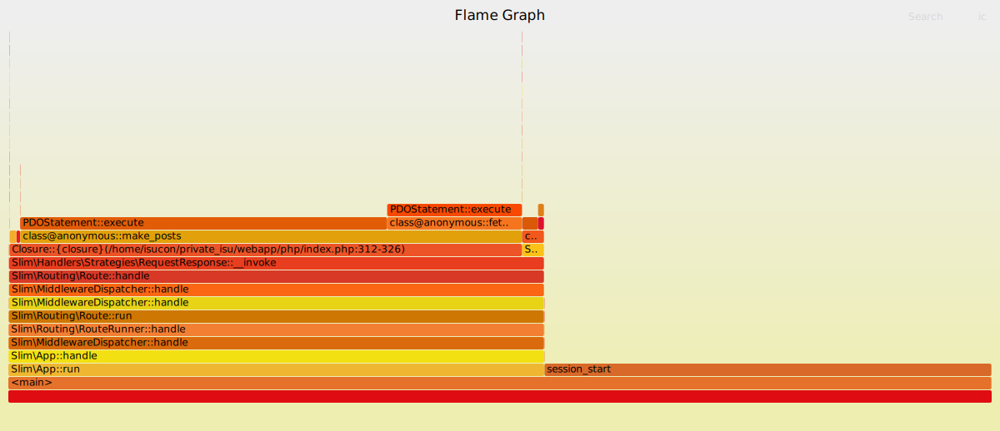

# 作業詳細ログ

ここには private-isu を解くにあたって実施している詳細の作業ログを記載します。

## 事前準備

競技用インスタンスにsshする。

```sh
ssh -i <.pemファイル> ubuntu@<Public IPv4 address>
```

isuconユーザに切り替えて、ホームディレクトリに移動

```sh
sudo su isucon
cd ~
```

### 初期データの準備

```sh
mkdir private_isu/webapp/sq
cd private_isu/
make init
```

MySQLコマンドへデータを流し込む (数分かかる)。

```sh
bunzip2 -c webapp/sql/dump.sql.bz2 | mysql -uisuconp -pisuconp
```

### 鍵の登録、~/.ssh/configの作成

`~/.ssh/authorized_keys` ファイルを作成する。isuconユーザに対して権限を付与する。

```sh
sudo mkdir ~/.ssh
sudo touch ~/.ssh/authorized_keys
sudo chown -R isucon:isucon ~/.ssh
```

GitHubの鍵を登録。

```sh
curl https://github.com/<あなたのGitHubユーザID>.keys >> ~/.ssh/authorized_keys
```

ログアウトし、pemファイルなしでログインできることを確認する。

```sh
ssh isucon@<Public IPv4 addressの値>
```

ベンチマーク用インスタンスでも同様の作業を実施する。

```sh
# ローカル
ssh -i <.pemファイル> ubuntu@<Public IPv4 address>

# サーバ上
sudo su isucon
cd ~
sudo mkdir ~/.ssh
sudo touch ~/.ssh/authorized_keys
sudo chown -R isucon:isucon ~/.ssh
curl https://github.com/<あなたのGitHubユーザID>.keys >> ~/.ssh/authorized_keys

# ローカルで確認
ssh isucon@<Public IPv4 addressの値>
```

必要な設定が終わったので、 `~/.ssh/config` を手元向けに作成する。中身は以下のような形（IPアドレスの値は実際の値と置き換える）。

```sh
Host isu01
  User isucon
  HostName <Public IPv4 addressの値>
Host isubench
  User isucon
  HostName <Public IPv4 addressの値>
```

設定が終わったら以下のようにssh可能になる。

```sh
ssh isu01
ssh isubench
```

## 動作確認とベンチマーカーの実行

競技用インスタンスのPublic IPv4 addressに直接ブラウザで (httpで) アクセスしたら「Iscogram」という名前のアプリが確認できる。

ベンチマーカーの実行はベンチマーカー用インスタンス上で以下のように実行する。

```sh
# sshした上で、
ssh isubench

# ベンチマーク実行
/home/isucon/private_isu.git/benchmarker/bin/benchmarker -u /home/isucon/private_isu.git/benchmarker/userdata -t http://<競技用インスタンスのPrivate IPv4 addresseの値>
```

以下のようなログが出力されます。

```sh
{"pass":true,"score":1026,"success":889,"fail":0,"messages":[]}
```

## rsync で必要なファイルだけ手元に持ってきて、GitHubへpushする

`isu01` 上のディレクトリ構成の感じを見つつ、以下のようなコマンドで不要なディレクトリを除外しつつ `webapp` 配下を持ってくる。

```sh
rsync -av --exclude 'sql' --exclude 'golang' --exclude 'node' --exclude 'ruby' isu01:~/private_isu/webapp ./
```

`webapp/docker-compose.yml` と `webapp/etc` は正直いらなそうなので手元から除外しつつ、必要なファイルだけ GitHub にpushしておく。

まず `.gitignore` に `vendor` を入れておく。

```.gitignore
vendor
```

その上で残りの `webapp` もcommitしてpushする。

## webapp/php 以下をサーバへ rsync

手元で composer install しつつ

```sh
cd webapp/php
composer install
```

webapp/php のみ rsyncでアップロードする。

```sh
rsync -av webapp/php/ isu01:~/private_isu/webapp/php/
```

## PHP実装に切り替え

[マニュアル](https://github.com/catatsuy/private-isu/blob/master/manual.md) に従ってPHP実装に切り替える。

```sh
sudo systemctl stop isu-ruby
sudo systemctl disable isu-ruby
sudo rm /etc/nginx/sites-enabled/isucon.conf
sudo ln -s /etc/nginx/sites-available/isucon-php.conf /etc/nginx/sites-enabled/
sudo systemctl reload nginx
sudo systemctl start php8.3-fpm
sudo systemctl enable php8.3-fpm
```

ログを確認する
```sh
$ sudo journalctl -f -u php8.3-fpm
Nov 28 23:15:25 ip-172-31-1-111 systemd[1]: Starting php8.3-fpm.service - The PHP 8.3 FastCGI Process Manager...
Nov 28 23:15:25 ip-172-31-1-111 systemd[1]: Started php8.3-fpm.service - The PHP 8.3 FastCGI Process Manager.
```

nginxのエラーログを tail しながらアプリをWebで開くと以下のようなエラーが出力される。

```sh
$ sudo tail -f /var/log/nginx/error.log
2024/11/28 23:16:56 [error] 3454#3454: *1042 FastCGI sent in stderr: "PHP message: PHP Fatal error:  Uncaught PDOException: SQLSTATE[HY000] [1698] Access denied for user 'root'@'localhost' in /home/isucon/private_isu/webapp/php/index.php:57
```

`/home/isucon/private_isu/webapp/php/index.php` の57行目を確認する。DBに接続できていない、そして root ユーザで接続しようとしている。

```php
    return new PDO(
        "mysql:dbname={$config['db']['database']};host={$config['db']['host']};port={$config['db']['port']};charset=utf8mb4",
        $config['db']['username'],
        $config['db']['password']
    );
```

ここでサーバ上の `env.sh` をみると以下のような値が設定されているので本来ならこれで動きそうだけど..

```sh
ISUCONP_DB_USER=isuconp
ISUCONP_DB_PASSWORD=isuconp
ISUCONP_DB_NAME=isuconp
```

手抜きしてアプリを修正して ([c642a45](https://github.com/stefafafan/private-isu-php/commit/c642a45ff4fdfa3a8e357c3a14aaefd3487e19c8)) なんとかする。

rsyncでデプロイしなおしたら無事PHP実装が動いていることをブラウザ上で確認できる。ベンチを回して点数がでたら無事成功。

```sh
{"pass":true,"score":3288,"success":3085,"fail":0,"messages":[]}
```

## スロークエリログの有効化とpt-query-digestの設定

MySQLの設定が `/etc/mysql/mysql.conf.d/mysqld.cnf` にあるので、それをひとまず手元に持ってくる。

```sh
mkdir -p ./etc/mysql/mysql.conf.d
rsync -av isu01:/etc/mysql/mysql.conf.d/mysqld.cnf ./etc/mysql/mysql.conf.d
```

スロークエリログを有効化する: [dd32d11](https://github.com/stefafafan/private-isu-php/commit/dd32d11b4e3c6020159f764cfa028a15ebe34a09)

rsyncでサーバ上へ反映し、mysqlを再起動する。sudo権限が必要なので、 `--rsync-path="sudo rsync"` というオプションをつけている。

```sh
# ローカル上で実行
rsync -av --rsync-path="sudo rsync" ./etc/mysql/mysql.conf.d/ isu01:/etc/mysql/mysql.conf.d/

# サーバ上で
sudo systemctl restart mysql
```

`systemctl status mysql.service` と実行して特にエラー表示になっていなければ成功。

```sh
$ systemctl status mysql.service
● mysql.service - MySQL Community Server
     Loaded: loaded (/usr/lib/systemd/system/mysql.service; >
     Active: active (running) since Thu 2024-11-28 23:39:45 >
    Process: 5119 ExecStartPre=/usr/share/mysql/mysql-system>
   Main PID: 5129 (mysqld)
     Status: "Server is operational"
      Tasks: 38 (limit: 4535)
     Memory: 405.2M (peak: 405.7M)
        CPU: 639ms
     CGroup: /system.slice/mysql.service
             └─5129 /usr/sbin/mysqld
```

次に pt-query-digest を入れます。以下の2行で入ります。

```sh
curl -LO https://percona.com/get/pt-query-digest
sudo install pt-query-digest /usr/local/bin/pt-query-digest
```

pt-query-digest の使い方は、第一引数としてスロークエリログファイルを渡すか、標準入力からパイプして渡すか、どちらでも利用できます。

```sh
# 第一引数に渡す方法
$ sudo pt-query-digest /var/log/mysql/mysql-slow.log

# パイプする方法
$ sudo cat /var/log/mysql/mysql-slow.log | pt-query-digest
```

ベンチマークを回すたびにログファイルが追記されていくのでベンチ実行前に `truncate` コマンドで中身を空にしておきましょう。
```sh
sudo truncate -s 0 /var/log/mysql/mysql-slow.log
```

## アクセスログ形式の変更とalpの設定

nginx の設定が `/etc/nginx/nginx.conf` にあるのでそれを手元に持ってくる。

```sh
mkdir -p ./etc/nginx/
rsync -av isu01:/etc/nginx/nginx.conf ./etc/nginx/
```

`/etc/nginx/nginx.conf` の中をみると、 `/etc/nginx/conf.d/*.conf` と `/etc/nginx/sites-enabled/*` がincludeされている。このへんにも関係ある設定がないかサーバ上で様子をみる。

```nginx
	include /etc/nginx/conf.d/*.conf;
	include /etc/nginx/sites-enabled/*;
```

サーバ上でみると、 `/etc/nginx/conf.d/` 以下は特に何もなさそう。代わりに `/etc/nginx/sites-enabled/isucon-php.conf` が置いてあった。

```sh
$ sudo ls /etc/nginx/conf.d/
$ sudo ls /etc/nginx/sites-enabled/
isucon-php.conf
```

isucon-php.conf も手元に持ってくる。

```sh
mkdir -p ./etc/nginx/sites-enabled
rsync -av isu01:/etc/nginx/sites-enabled/isucon-php.conf ./etc/nginx/sites-enabled
```

これらの設定をGitHubにpushしておく。

コミットしてみたところ、 `/etc/nginx/sites-enabled/isucon-php.conf` は実はシンボリックリンクで、中身は `/etc/nginx/sites-available/isucon-php.conf` にあるということがGitHubの表示からわかる。

実体のほうがほしいので `/etc/nginx/sites-available/isucon-php.conf` を持ってくる。

```sh
rm -rf etc/nginx/sites-enabled/
mkdir -p ./etc/nginx/sites-available
rsync -av isu01:/etc/nginx/sites-available/isucon-php.conf ./etc/nginx/sites-available
```

アクセスログの設定をします。alpはltsv形式でもjson形式でも対応できますが今回はjson形式にしてみましょう。

[alpのREADMEを参考に](https://github.com/tkuchiki/alp/blob/d91a23dc2d71521c5a9e166faf92f68d082fb85f/README.md#json)、 `/etc/nginx/nginx.conf` の設定をします: [b31b876](https://github.com/stefafafan/private-isu-php/commit/b31b8769e0dd1157d3e2a368333ab38cc95fe930)

変更内容をrsyncでサーバに反映します。

```sh
# ローカル上で実行
rsync -av --rsync-path="sudo rsync" ./etc/nginx/nginx.conf isu01:/etc/nginx/nginx.conf

# サーバ上で
sudo systemctl restart nginx
```

alpを入れます。 https://github.com/tkuchiki/alp/releases から最新の `alp_linux_amd64.zip` のリンクをコピーして、以下のようにサーバ上で入れます。

```sh
wget https://github.com/tkuchiki/alp/releases/download/v1.0.21/alp_linux_amd64.zip
unzip alp_linux_amd64.zip
sudo install alp /usr/local/bin/alp
```

alpの使い方はアクセスログを標準入力からパイプして渡す形です。今回はjson形式にしたので、 `alp json` を使います。

```sh
sudo cat /var/log/nginx/access.log | alp json
```

まだベンチを回していないので最初は上手くいきません。一度アクセスログの中身もtruncateしておきましょう。

```sh
sudo truncate -s 0 /var/log/nginx/access.log
```

## PHP向けプロファイラ reliforp/reli-prof を導入する

pt-query-digest と alp でざっくりとボトルネックを知ることはできますが、PHPのアプリケーション内でどこがボトルネックかドリルダウンしたい場合はプロファイラも活用できると便利です。 [reliforp/reli-prof](https://github.com/reliforp/reli-prof) を導入します。以下の記事を丸々参考にしました。

- [Reli を使った PHP 7.x/8.x サービスの計測｜技術ブログ｜北海道札幌市・宮城県仙台市のVR・ゲーム・システム開発 インフィニットループ](https://www.infiniteloop.co.jp/tech-blog/2023/03/profiling-php8-using-reli/)

競技用インスタンス上で reli-prof を入れます。

```sh
composer create-project reliforp/reli-prof
cd reli-prof
```

使い方としては、topコマンド的にどこに負荷がかかっているか知りたい場合は `reli-prof` のディレクトリ内の `reli` コマンドの `i:top` サブコマンドを使います。 `-P` オプションが必須パラメータでここでプロセス名を正規表現でマッチさせる必要があります。 private-isu の場合は `php-fpm` が起動しているのでこれを指定します。
```sh
sudo ./reli i:top -P "php-fpm"
```

psコマンドを使って動いているプロセスの名前を確認している様子:

```sh
$ ps auxfw | grep fpm
root         594  0.0  0.6 209068 23900 ?        Ss   11:31   0:00 php-fpm: master process (/etc/php/8.3/fpm/php-fpm.conf)
isucon      2071  0.1  0.4 209632 19228 ?        S    11:49   0:00  \_ php-fpm: pool www
isucon      2150  0.0  0.4 209632 19332 ?        S    11:49   0:00  \_ php-fpm: pool www
isucon      2181  0.0  0.4 209632 18792 ?        S    11:50   0:00  \_ php-fpm: pool www
isucon      2214  0.0  0.0   7076  2176 pts/0    S+   11:51   0:00              \_ grep fpm
```

reli実行中にブラウザでアプリを開いて何度かリロードするとリアルタイムに状況が反映されます。以下の例をみると `PDOStatement::execute` が重いっぽいということがわかります。

```sh
{php-fpm}
samp_count=199  func_count=44  total_count=6445

total_incl total_excl incl excl     % name
      4730       4729  178  178 89.45 PDOStatement::execute
      1679       1679   21   21 10.55 session_start
     14281          0  534    0  0.00 Slim\MiddlewareDispatcher::handle
      6446          0  199    0  0.00 <main>
      4663          3  178    0  0.00 class@anonymous::make_posts
...
```

top的な使い方なら以上ですが、FlameGraph形式でみれるようにするために `i:daemon` サブコマンドを使いつつ、結果をファイルに出力します。

```sh
sudo ./reli i:daemon -P "php-fpm" > traces.log
```

何度かブラウザをリロードして満足したら上記のコマンドを止めます。そして、 `c:flamegraph` コマンドを使ってsvgを作成します。

```sh
./reli c:flamegraph < traces.log > traces.svg
```

svg画像の結果を見たいので、ローカルへとrsyncします。

```sh
rsync isu01:~/reli-prof/traces.svg ./
```

あとは `open traces.svg` など実行して、デフォルトのアプリケーション (Chromeなど) でsvgファイルを開きます。以下のようなflamegraphが確認できます。横の軸で長いところがCPUを長く占有しているので、ぱっとみ `make_posts` が結構時間かかっていそうだな、みたいなことがこれを見てわかります。



`traces.log` の今回の内容も不要になったので truncate コマンドで中身をクリアしておきます。

```sh
truncate -s 0 ./traces.log
```

nginxのアクセスログ、mysqlのスロークエリログとともにtruncateが完了したらいよいよベンチを回してボトルネックを探す準備ができました。

## 最初のボトルネックを特定する

基本的に以下の流れで進めます。

1. 各種ログファイルをtruncateする
2. topコマンドとreliコマンドをサーバ上で実行しておく
3. ベンチマークを走らせる
4. 各種ツールで分析を開始する
5. 分析結果を元にボトルネックを予想して、そこを対処するための作業を実施
6. デプロイして再び1に戻る。修正が成功したら続行、不発だったらrevertしつつ次の手を考えてやり直す

2を実施するには最低2画面が必要で、今回benchmarkも実行しないといけないので3画面でサーバに入っておく必要があります。ターミナルの分割に慣れておくことをおすすめします（別タブやウィンドウでも問題ないが、少なくともベンチが走っている間はtopコマンドの結果がみれるようにしておく）。

というわけでtopとreliとベンチをそれぞれ実施します。

```sh
# isu01 1つめのタブ
top

# isu01 2つめのタブ
sudo ./reli i:daemon -P "php-fpm" > traces.log

# isubench のタブ
/home/isucon/private_isu.git/benchmarker/bin/benchmarker -u /home/isucon/private_isu.git/benchmarker/userdata -t http://<isu01のPrivate IPアドレス>
```

`top` コマンドを使うときはキーボードで `1` を押すとCPUのコアごとの内容を個別に見られるようになり、 `c` を押すと実行中のコマンドの詳細を確認できます。以下が結果の様子です。

```sh
top - 13:45:03 up  2:13,  4 users,  load average: 2.21, 0.62, 0.24
Tasks: 194 total,   2 running, 192 sleeping,   0 stopped,   0 zombie
%Cpu0  : 96.4 us,  3.3 sy,  0.0 ni,  0.0 id,  0.0 wa,  0.0 hi,  0.3 si,  0.0 st
%Cpu1  : 96.0 us,  4.0 sy,  0.0 ni,  0.0 id,  0.0 wa,  0.0 hi,  0.0 si,  0.0 st
MiB Mem :   3794.9 total,   1804.0 free,   1245.0 used,    999.3 buff/cache
MiB Swap:      0.0 total,      0.0 free,      0.0 used.   2549.9 avail Mem

    PID USER      PR  NI    VIRT    RES    SHR S  %CPU  %MEM     TIME+ COMMAND
    842 mysql     20   0 1792356 499640  36864 S 171.8  12.9   7:05.20 /usr/sbin/mysqld
   4346 root      20   0  162468  30592  16640 S   8.0   0.8   0:01.91 php ./reli i:daemon -P php-fpm
   4351 root      20   0   88600  27648  16768 S   2.3   0.7   0:00.58 amp-process
   2308 isucon    20   0  209632  19112  12288 S   2.0   0.5   0:01.10 php-fpm: pool www
   4355 root      20   0   88600  27520  16640 R   2.0   0.7   0:00.57 amp-process
   4357 root      20   0   88600  27648  16768 S   2.0   0.7   0:00.56 amp-proces
```

どうやらMySQLの負荷が支配的のようです (CPU使用率が171.8%)。上記の例だとその次に高いのが reli-prof の実行です。このサーバはCPUが2コア (`%Cpu0` と `%Cpu1` の二つが表示されている)ので、CPU使用率の合計はマックスで200%です。

MySQLの負荷を下げられないかを念頭に入れつつ、各種結果を確認していきます。

まずalpの結果です。一旦以下のコマンドを実行してみると、返ってくる結果が非常に見づらいです。 `/@michele` のようなユーザ詳細画面が個別に出ているし、 `/posts/7967` や `/image/9909.jpg` のようなエンドポイントもバラバラに出力されています。

```sh
sudo cat /var/log/nginx/access.log | alp json
```

上記三つのエンドポイントを正規表現を使ってグルーピングします。 `-m` オプションにカンマ区切りで正規表現を渡します。

```sh
sudo cat /var/log/nginx/access.log | alp json -m "^/@.+$,^/posts/\d+$,^/image/.+$"
```

並び順がバラバラなので `--sort` オプションと、降順にするための `-r` もつけます。

```sh
sudo cat /var/log/nginx/access.log | alp json -m "^/@.+$,^/posts/\d+$,^/image/.+$" --sort sum -r
```

この結果が以下の通りです。 `/` のエンドポイントがまず重そうです。

| COUNT | 1XX | 2XX  | 3XX | 4XX | 5XX | METHOD |        URI         |  MIN  |  MAX  |   SUM   |  AVG  |  P90  |  P95  |  P99  | STDDEV | MIN(BODY) |  MAX(BODY)  |   SUM(BODY)   | AVG(BODY)  |
|-------|-----|------|-----|-----|-----|--------|--------------------|-------|-------|---------|-------|-------|-------|-------|--------|-----------|-------------|---------------|------------|
| 103   | 0   | 103  | 0   | 0   | 0   | GET    | /                  | 0.875 | 5.175 | 275.395 | 2.674 | 3.712 | 4.270 | 5.005 | 0.823  | 4409.000  | 5886.000    | 537822.000    | 5221.573   |
| 1517  | 0   | 1517 | 0   | 0   | 0   | GET    | ^/image/.+$        | 0.001 | 2.456 | 268.300 | 0.177 | 0.520 | 0.838 | 1.912 | 0.331  | 34439.000 | 1057898.000 | 295909057.000 | 195062.002 |
| 131   | 0   | 131  | 0   | 0   | 0   | GET    | ^/posts/\d+$       | 0.042 | 2.060 | 48.283  | 0.369 | 0.883 | 1.324 | 1.657 | 0.379  | 750.000   | 1836.000    | 167699.000    | 1280.145   |
| 27    | 0   | 27   | 0   | 0   | 0   | GET    | ^/@.+$             | 0.266 | 3.810 | 40.344  | 1.494 | 2.253 | 2.616 | 3.810 | 0.695  | 1480.000  | 4730.000    | 86848.000     | 3216.593   |
| 15    | 0   | 15   | 0   | 0   | 0   | GET    | /posts             | 0.846 | 4.244 | 32.118  | 2.141 | 3.374 | 4.244 | 4.244 | 1.034  | 5166.000  | 5625.000    | 79875.000     | 5325.000   |
| 71    | 0   | 0    | 71  | 0   | 0   | POST   | /login             | 0.002 | 1.568 | 17.593  | 0.248 | 0.860 | 1.028 | 1.568 | 0.351  | 5.000     | 5.000       | 355.000       | 5.000      |
| 20    | 0   | 0    | 10  | 10  | 0   | POST   | /                  | 0.002 | 1.631 | 5.838   | 0.292 | 0.828 | 0.830 | 1.631 | 0.404  | 5.000     | 13.000      | 180.000       | 9.000      |
| 18    | 0   | 18   | 0   | 0   | 0   | GET    | /login             | 0.001 | 1.443 | 4.800   | 0.267 | 1.374 | 1.443 | 1.443 | 0.421  | 633.000   | 633.000     | 11394.000     | 633.000    |
| 11    | 0   | 0    | 11  | 0   | 0   | POST   | /register          | 0.013 | 1.842 | 3.203   | 0.291 | 0.443 | 1.842 | 1.842 | 0.503  | 5.000     | 5.000       | 55.000        | 5.000      |
| 13    | 0   | 0    | 13  | 0   | 0   | POST   | /comment           | 0.006 | 0.952 | 2.682   | 0.206 | 0.595 | 0.952 | 0.952 | 0.266  | 5.000     | 5.000       | 65.000        | 5.000      |
| 9     | 0   | 0    | 9   | 0   | 0   | GET    | /logout            | 0.001 | 0.890 | 1.656   | 0.184 | 0.890 | 0.890 | 0.890 | 0.271  | 5.000     | 5.000       | 45.000        | 5.000      |
| 11    | 0   | 0    | 0   | 11  | 0   | GET    | /admin/banned      | 0.003 | 0.256 | 0.901   | 0.082 | 0.172 | 0.256 | 0.256 | 0.081  | 34.000    | 34.000      | 374.000       | 34.000     |
| 1     | 0   | 1    | 0   | 0   | 0   | GET    | /initialize        | 0.053 | 0.053 | 0.053   | 0.053 | 0.053 | 0.053 | 0.053 | 0.000  | 31.000    | 31.000      | 31.000        | 31.000     |
| 170   | 0   | 170  | 0   | 0   | 0   | GET    | /favicon.ico       | 0.000 | 0.000 | 0.000   | 0.000 | 0.000 | 0.000 | 0.000 | 0.000  | 43.000    | 43.000      | 7310.000      | 43.000     |
| 170   | 0   | 170  | 0   | 0   | 0   | GET    | /js/timeago.min.js | 0.000 | 0.000 | 0.000   | 0.000 | 0.000 | 0.000 | 0.000 | 0.000  | 1915.000  | 1915.000    | 325550.000    | 1915.000   |
| 170   | 0   | 170  | 0   | 0   | 0   | GET    | /js/main.js        | 0.000 | 0.000 | 0.000   | 0.000 | 0.000 | 0.000 | 0.000 | 0.000  | 1824.000  | 1824.000    | 310080.000    | 1824.000   |
| 170   | 0   | 170  | 0   | 0   | 0   | GET    | /css/style.css     | 0.000 | 0.000 | 0.000   | 0.000 | 0.000 | 0.000 | 0.000 | 0.000  | 1549.000  | 1549.000    | 263330.000    | 1549.000   |

次にpt-query-digestの結果も見てみます。標準出力に全部出すのもよいですが、 `less` などにパイプしてもよいでしょう。

```sh
sudo cat /var/log/mysql/mysql-slow.log | pt-query-digest | less
```

今回3件しか表示されなくて量が少なく感じたので `--limit` オプションを使って上位10件くらい出してみましょう。

```sh
sudo cat /var/log/mysql/mysql-slow.log | pt-query-digest --limit 10 | less
```

結果は以下のような感じでした。1位のクエリが 67.8% を占めていて非常に重そうです。 `Calls` の数はそれほど多いわけではなく、 `R/Call` つまり呼び出しごとのレスポンスが 0.07 と遅めなので、これはおそらくN+1などではなく、クエリ単体で重そうです。

```sql
# Profile
# Rank Query ID                            Response time  Calls R/Call V/M
# ==== =================================== ============== ===== ====== ===
#    1 0x624863D30DAC59FA16849282195BE09F  208.9196 67.8%  2801 0.0746  0.00 SELECT comments
#    2 0x422390B42D4DD86C7539A5F45EB76A80   79.6292 25.8%  2932 0.0272  0.00 SELECT comments
#    3 0x100EC8B5C400F34381F9D7F7FA80A53D   10.8826  3.5%   131 0.0831  0.00 SELECT comments
#    4 0x4858CF4D8CAA743E839C127C71B69E75    3.2084  1.0%   103 0.0311  0.00 SELECT posts
#    5 0x396201721CD58410E070DA9421CA8C8D    1.6841  0.5% 11213 0.0002  0.00 SELECT users
#    6 0x19759A5557089FD5B718D440CBBB5C55    1.0707  0.3%  1648 0.0006  0.00 SELECT posts
#    7 0xC37F2207FE2E699A3A976F5EBE87A97C    0.8592  0.3%    27 0.0318  0.00 SELECT comments
#    8 0xCDEB1AFF2AE2BE51B2ED5CF03D4E749F    0.7753  0.3%    27 0.0287  0.00 SELECT comments
#    9 0x7A12D0C8F433684C3027353C36CAB572    0.5149  0.2%    15 0.0343  0.00 SELECT posts
#   10 0x009A61E5EFBD5A5E4097914B4DBD1C07    0.3290  0.1%    10 0.0329  0.02 INSERT posts
# MISC 0xMISC                                0.4730  0.2%  1769 0.0003   0.0 <13 ITEMS>
```

下の方にいくと詳細があります。1位のクエリは `SELECT * FROM comments WHERE post_id = '10000' ORDER BY created_at DESC LIMIT 3\G` で、特段複雑ではないですが、分布的に10msか100msかかっています。

```sql
# Query 1: 37.85 QPS, 2.82x concurrency, ID 0x624863D30DAC59FA16849282195BE09F at byte 1239926
# Scores: V/M = 0.00
# Time range: 2024-12-02T04:44:33 to 2024-12-02T04:45:47
# Attribute    pct   total     min     max     avg     95%  stddev  median
# ============ === ======= ======= ======= ======= ======= ======= =======
# Count         13    2801
# Exec time     67    209s    28ms   126ms    75ms    95ms    19ms    71ms
# Lock time     21     4ms       0   379us     1us     1us    10us     1us
# Rows sent      0   6.76k       0       3    2.47    2.90    1.11    2.90
# Rows examine  47 267.15M  97.66k  97.67k  97.66k  97.04k       0  97.04k
# Query size     4 230.33k      82      85   84.20   84.10    1.50   80.10
# String:
# Hosts        localhost
# Users        isuconp
# Query_time distribution
#   1us
#  10us
# 100us
#   1ms
#  10ms  ################################################################
# 100ms  #####
#    1s
#  10s+
# Tables
#    SHOW TABLE STATUS LIKE 'comments'\G
#    SHOW CREATE TABLE `comments`\G
# EXPLAIN /*!50100 PARTITIONS*/
SELECT * FROM `comments` WHERE `post_id` = '10000' ORDER BY `created_at` DESC LIMIT 3\G
```

一応サーバ上のMySQLに繋いでEXPLAINしてみましょう。

```sql
mysql> EXPLAIN SELECT * FROM `comments` WHERE `post_id` = '10000' ORDER BY `created_at` DESC LIMIT 3\G
*************************** 1. row ***************************
           id: 1
  select_type: SIMPLE
        table: comments
   partitions: NULL
         type: ALL
possible_keys: NULL
          key: NULL
      key_len: NULL
          ref: NULL
         rows: 99631
     filtered: 10.00
        Extra: Using where; Using filesort
1 row in set, 1 warning (0.00 sec)
```

`possible_keys` も `key` もNULLなのでINDEXが使われていなさそう、 `rows` が9万行みているし、 `Extra` にも `Using filesort` がいるのでINDEXを足しましょう。

ちなみに `pt-query-digest` の2位以下のクエリは以下の通りです。

```sql
-- 2位
SELECT COUNT(*) AS `count` FROM `comments` WHERE `post_id` = '6777'\G
-- 3位
SELECT * FROM `comments` WHERE `post_id` = '6121' ORDER BY `created_at` DESC\G
-- 4位
SELECT `id`, `user_id`, `body`, `mime`, `created_at` FROM `posts` ORDER BY `created_at` DESC\G
```

`comments` テーブルを `post_id` で引いたり、引いた上で `created_at DESC` で並び替えしたりしているのでこの辺りにINDEXを効かせられたら1~3位のスロークエリをまとめて対処できそうです。private-isuの場合はALTER TABLEをするための仕組みは特にないので、サーバ上でmysql繋いで直接適用させちゃいます。

```sql
mysql> ALTER TABLE comments ADD INDEX post_id_created_at_idx (post_id, created_at DESC);
Query OK, 0 rows affected (0.53 sec)
Records: 0  Duplicates: 0  Warnings: 0
```

あらためてEXPLAINして様子をみます。

```sql
mysql> EXPLAIN SELECT * FROM `comments` WHERE `post_id` = '10000' ORDER BY `created_at` DESC LIMIT 3\G
*************************** 1. row ***************************
           id: 1
  select_type: SIMPLE
        table: comments
   partitions: NULL
         type: ref
possible_keys: post_id_created_at_idx
          key: post_id_created_at_idx
      key_len: 4
          ref: const
         rows: 11
     filtered: 100.00
        Extra: NULL
1 row in set, 1 warning (0.00 sec)
```

ちゃんとindexが使われ、rowsの結果も11行と平和になり、filesortも消えました。

ベンチ回して結果をみたいところですがせっかくなのでreli-profの結果も最後に確認しましょう。

```sh
# サーバ上で
./reli c:flamegraph < traces.log > traces.svg

# ローカルで
rsync isu01:~/reli-prof/traces.svg ./
open traces.svg
```


やはり `make_posts` が何やら重そう、ということがわかります。今回はもうINDEX追加をしたのでこれ以上何もせずに、各種ログをtruncateして再びベンチを回します。

```sh
sudo truncate -s 0 /var/log/nginx/access.log
sudo truncate -s 0 /var/log/mysql/mysql-slow.log
truncate -s 0 ~/reli-prof/traces.log
```

topコマンドを実行しながら再度ベンチを回すと様子が変わりました
```sh
top - 14:25:02 up  2:53,  5 users,  load average: 2.66, 0.65, 0.27
Tasks: 197 total,   4 running, 193 sleeping,   0 stopped,   0 zombie
%Cpu0  : 61.3 us, 34.8 sy,  0.0 ni,  0.3 id,  0.3 wa,  0.0 hi,  3.3 si,  0.0 st
%Cpu1  : 61.4 us, 33.7 sy,  0.0 ni,  0.3 id,  0.3 wa,  0.0 hi,  4.3 si,  0.0 st
MiB Mem :   3794.9 total,   1409.6 free,   1326.5 used,   1314.9 buff/cache
MiB Swap:      0.0 total,      0.0 free,      0.0 used.   2468.4 avail Mem

    PID USER      PR  NI    VIRT    RES    SHR S  %CPU  %MEM     TIME+ COMMAND
    842 mysql     20   0 1829268 572856  38144 S  70.8  14.7   8:42.52 /usr/sbin/mysqld
   4467 isucon    20   0  213728  22440  12288 R  12.6   0.6   0:03.61 php-fpm: pool www
   5649 isucon    20   0  209632  19232  12416 R  12.6   0.5   0:02.52 php-fpm: pool www
   5496 isucon    20   0  209632  19176  12416 S  12.3   0.5   0:02.61 php-fpm: pool www
   3399 isucon    20   0  209632  20136  13312 S  12.0   0.5   0:04.36 php-fpm: pool www
   4442 isucon    20   0  215776  24764  12416 S  12.0   0.6   0:03.68 php-fpm: pool www
   5296 root      20   0  162468  30720  16768 S   8.3   0.8   0:01.81 php /home/isucon/reli-prof/reli i:daemon -P php-fpm
    673 www-data  20   0   13412   5992   4224 S   7.0   0.2   0:02.16 nginx: worker process
    589 memcache  20   0  415208   8704   3840 S   4.3   0.2   0:02.87 /usr/bin/memcached -m 64 -p 11211 -u memcache -l 127.0.0.1 -l ::1 -P /var/run/memcached/memcached.pid
    672 www-data  20   0   13316   5984   4224 S   4.3   0.2   0:02.33 nginx: worker process
```

MySQLは以前として負荷は 70.8% と高めではあるが、70/200% と考えるとそうでもないし、 `php-fpm` のCPU使用率を合算すると 12% x5 = 60% くらいになっている。 

点数はちゃんと上がりました。

## 便利なMakefileを作成する

サーバに毎回ログインして作業をするのが面倒なので、Makefileを作って楽にしましょう。

何度もやっている作業は何かというと..
- デプロイ
- ログのtruncate
- サービスの再起動

それぞれのケースにローカルから実行できるコマンドを作ってそれをMakefileに組み込みます。

アプリのデプロイ (rsync) は以下のコマンドを使ってきました。

```sh
rsync -av webapp/php/ isu01:~/private_isu/webapp/php/
```

これをそのままMakefileにdeploy-appとして記述します。

```makefile
deploy-app:
	rsync -av webapp/php/ isu01:~/private_isu/webapp/php/
```

この状態でMakefileがあるディレクトリで `make deploy-app` を打つとデプロイされます。

```sh
$ make deploy-app
rsync -av webapp/php/ isu01:~/private_isu/webapp/php/
building file list ... done

sent 42202 bytes  received 20 bytes  28148.00 bytes/sec
total size is 60578418  speedup is 1434.76
```

この調子で記述していきます。

```makefile
deploy-app:
	rsync -av webapp/php/ isu01:~/private_isu/webapp/php/

deploy-nginx:
	rsync -av --rsync-path="sudo rsync" ./etc/nginx/nginx.conf isu01:/etc/nginx/nginx.conf
	rsync -av --rsync-path="sudo rsync" ./etc/nginx/sites-available/isucon-php.conf isu01:/etc/nginx/sites-available/isucon-php.conf
	ssh isu01 "sudo systemctl restart nginx"

deploy-mysql:
	rsync -av --rsync-path="sudo rsync" ./etc/mysql/mysql.conf.d/mysqld.cnf isu01:/etc/mysql/mysql.conf.d/mysqld.cnf
	ssh isu01 "sudo systemctl restart mysql"
```

`deploy: deploy-app deploy-nginx deploy-mysql` みたいに書いておくと、 `make deploy` だけで全部実行させることができます。

手元から alp の結果などもみれるようにしましょう。

```makefile
analyze-nginx:
	ssh isu01 sudo cat /var/log/nginx/access.log | alp json -m "^/@.+,^/posts/\d+,^/image/.+" --sort sum -r
```

```makefile
analyze-mysql:
	ssh isu01 sudo cat /var/log/mysql/mysql-slow.log | pt-query-digest --limit 10 > slow_query.log
```

```makefile
flamegraph:
	ssh isu01 "sudo ~/reli-prof/reli c:flamegraph < ~/reli-prof/traces.log > ~/reli-prof/traces.svg"
	rsync isu01:~/reli-prof/traces.svg ./
	open traces.svg
```

各種ファイルのtruncateや削除も用意する

```makefile
truncate-logs:
	ssh isu01 "sudo truncate -s 0 /var/log/nginx/access.log"
	ssh isu01 "sudo truncate -s 0 /var/log/mysql/mysql-slow.log"
	ssh isu01 "rm ~/reli-prof/traces.log"
```

今後の作業はこんな感じにできるようになりました。

```sh
# ソースコードを変更する

# デプロイと再起動
$ make deploy

# ベンチを実行してreli-profやtopを実行

# 終わったら各種集計
$ make analyze-nginx
$ make analyze-mysql
$ make flamegraph

# 各種ファイルをtruncate
$ make truncate-logs
```

最終的に追加したMakefile: [452d30e](https://github.com/stefafafan/private-isu-php/commit/452d30ec281d2c67193ff3354967507898d88c2a)

## 画像をファイルに書き出しつつ、nginxから配信する

alpの結果を踏まえると次に `/image/\d+` をなんとかしたいです。

画像をアプリケーションから返すタイミングでファイルにも書き出すようにするのと、nginxからtry_filesを使って画像があれば返すという風にします。

ひとまず画像をファイルとして書き出す処理を追加します: [c38c147](https://github.com/stefafafan/private-isu-php/commit/c38c147e83ba5a3e4a9ad90fbf757eab5049e9b4)

その上で、サーバ上の `webapp/public/` 以下に `image` ディレクトリを作っておきます。わかりやすいようにエンドポイントと揃えています。

```sh
$ pwd
/home/isucon/private_isu/webapp/public

$ mkdir image
```

これでブラウザで何度かアクセスしたらこのディレクトリ内に画像が書き出されていることが確認できました。

```sh
~/private_isu/webapp/public/image$ ls
10417.jpg  10419.png  10421.png  10423.jpg  10425.png  10427.jpg  10429.png  10431.png  10433.jpg  10435.jpg
10418.jpg  10420.jpg  10422.png  10424.jpg  10426.png  10428.jpg  10430.png  10432.jpg  10434.png  10436.jpg
```

次にnginxから返す設定を書きます: [c150c89](https://github.com/stefafafan/private-isu-php/commit/c150c898422cd8133d5e822ad6f225f46dc2925d)

元々は try_files の最後の引数として localhost を指定していたが、PHP実装の場合はそれではうまくいかなかったため以下のエントリでもやっているように `/index.php` を返すようにしています。

https://zenn.dev/eichisanden/scraps/7798c55153787b#comment-a74e67f497db3b

状況が変わり、再びMySQLの負荷の割合が高まりました。

```sh
top - 15:49:12 up  4:17,  8 users,  load average: 1.96, 0.51, 0.29
Tasks: 208 total,   4 running, 204 sleeping,   0 stopped,   0 zombie
%Cpu0  : 70.2 us, 28.5 sy,  0.0 ni,  0.0 id,  0.0 wa,  0.0 hi,  1.3 si,  0.0 st
%Cpu1  : 67.2 us, 30.8 sy,  0.0 ni,  0.3 id,  0.3 wa,  0.0 hi,  1.3 si,  0.0 st
MiB Mem :   3794.9 total,    324.1 free,   1446.5 used,   2290.7 buff/cache
MiB Swap:      0.0 total,      0.0 free,      0.0 used.   2348.4 avail Mem

    PID USER      PR  NI    VIRT    RES    SHR S  %CPU  %MEM     TIME+ COMMAND
  14021 mysql     20   0 1834512 634384  37888 S  95.7  16.3   1:55.30 /usr/sbin/mysqld
  24125 isucon    20   0  215776  24796  12416 R  10.0   0.6   0:09.41 php-fpm: pool www
  34109 isucon    20   0  215776  24780  12544 R  10.0   0.6   0:01.69 php-fpm: pool www
  34270 isucon    20   0  209632  19284  12544 S  10.0   0.5   0:01.61 php-fpm: pool www
  16044 isucon    20   0  211680  21372  12544 S   9.6   0.5   0:16.75 php-fpm: pool www
  24230 isucon    20   0  215776  25516  13184 S   9.0   0.7   0:09.16 php-fpm: pool www
  33981 root      20   0  162468  30848  16896 S   8.6   0.8   0:01.52 php /home/isucon/reli-prof/reli i:daemon -P php-fpm
```

flamegraphをみると、alpの結果と同様にトップページが遅く、その中でも `PDOStatement::execute` が遅いらしい。

pt-query-digestの `SELECT * FROM `comments` WHERE `post_id` = '10000' ORDER BY `created_at` DESC LIMIT 3` のクエリ実行が確かに遅いので、次はこのクエリの改善が必要です。

## postsとusersをJOINして取得している行数を減らす

```sql
mysql> EXPLAIN SELECT `id`, `user_id`, `body`, `mime`, `created_at` FROM `posts` ORDER BY `created_at` DESC\G
*************************** 1. row ***************************
           id: 1
  select_type: SIMPLE
        table: posts
   partitions: NULL
         type: ALL
possible_keys: NULL
          key: NULL
      key_len: NULL
          ref: NULL
         rows: 9317
     filtered: 100.00
        Extra: Using filesort
1 row in set, 1 warning (0.00 sec)
```

このクエリが 9000 行近く引いてきているので、全件取得をなくすようにコードを修正します: [188217a](https://github.com/stefafafan/private-isu-php/commit/188217a69723de5d2e09ad4578b1ff7f5aae74ef)

JOINしたクエリをExplainしてもまだrowsの参照が多い:

```sql
mysql> EXPLAIN SELECT `posts`.`id`, `posts`.`user_id`, `posts`.`body`, `posts`.`mime`, `posts`.`created_at` FROM `posts` JOIN  `users` ON `posts`.`user_id` = `users`.`id` WHERE `users`.`del_flg` = 0 ORDER BY `created_at` DESC LIMIT 20\G
*************************** 1. row ***************************
           id: 1
  select_type: SIMPLE
        table: posts
   partitions: NULL
         type: ALL
possible_keys: NULL
          key: NULL
      key_len: NULL
          ref: NULL
         rows: 9317
     filtered: 100.00
        Extra: Using filesort
*************************** 2. row ***************************
           id: 1
  select_type: SIMPLE
        table: users
   partitions: NULL
         type: eq_ref
possible_keys: PRIMARY
          key: PRIMARY
      key_len: 4
          ref: isuconp.posts.user_id
         rows: 1
     filtered: 10.00
        Extra: Using where
2 rows in set, 1 warning (0.00 sec)
```

以下のINDEXも足しておきます:

```sql
ALTER TABLE posts ADD INDEX created_at_idx (created_at DESC);
```

意図通りの `rows` の件数になりました。

```sql
mysql> EXPLAIN SELECT `posts`.`id`, `posts`.`user_id`, `posts`.`body`, `posts`.`mime`, `posts`.`created_at` FROM `posts` JOIN  `users` ON `posts`.`user_id` = `users`.`id` WHERE `users`.`del_flg` = 0 ORDER BY `created_at` DESC LIMIT 20\G
*************************** 1. row ***************************
           id: 1
  select_type: SIMPLE
        table: posts
   partitions: NULL
         type: index
possible_keys: NULL
          key: created_at_idx
      key_len: 4
          ref: NULL
         rows: 199
     filtered: 100.00
        Extra: NULL
*************************** 2. row ***************************
           id: 1
  select_type: SIMPLE
        table: users
   partitions: NULL
         type: eq_ref
possible_keys: PRIMARY
          key: PRIMARY
      key_len: 4
          ref: isuconp.posts.user_id
         rows: 1
     filtered: 10.00
        Extra: Using where
2 rows in set, 1 warning (0.00 sec)
```

## make_posts呼び出している箇所をまとめて改善

さっきはトップページでの make_posts を呼ぶ前のクエリのみ改善したが、他にも呼ばれているので同様の形でまとめて解消する: [4ba3089](https://github.com/stefafafan/private-isu-php/commit/4ba3089cb1814b26bd8eade2a8232800b995cd39)

その上で、make_posts内で不要になった処理をなくした: [5022739](https://github.com/stefafafan/private-isu-php/commit/5022739217588edc05e5e1dd9fc996851b1eca3b)

この状態であらためてtopを眺めると、引き続きMySQLの負荷の割合は高い。

```sh
top - 16:37:39 up  5:05, 10 users,  load average: 2.42, 1.13, 0.71
Tasks: 207 total,   6 running, 201 sleeping,   0 stopped,   0 zombie
%Cpu0  : 63.2 us, 32.5 sy,  0.0 ni,  0.0 id,  1.0 wa,  0.0 hi,  3.3 si,  0.0 st
%Cpu1  : 66.1 us, 30.2 sy,  0.0 ni,  0.7 id,  0.7 wa,  0.0 hi,  2.3 si,  0.0 st
MiB Mem :   3794.9 total,    194.0 free,   1477.7 used,   2399.3 buff/cache
MiB Swap:      0.0 total,      0.0 free,      0.0 used.   2317.2 avail Mem

    PID USER      PR  NI    VIRT    RES    SHR S  %CPU  %MEM     TIME+ COMMAND
  14021 mysql     20   0 1837044 649928  38400 S  80.5  16.7   4:47.90 /usr/sbin/mysqld
  43058 isucon    20   0  209632  20268  13440 R   8.9   0.5   0:12.80 php-fpm: pool www
  70573 root      20   0  162468  30720  16768 S   8.9   0.8   0:01.64 php /home/isucon/reli-prof/reli i:daemon -P php-fpm
  55424 isucon    20   0  209632  20264  13440 R   8.6   0.5   0:07.17 php-fpm: pool www
  70854 isucon    20   0  209632  19212  12544 S   8.6   0.5   0:01.43 php-fpm: pool www
  70677 isucon    20   0  209632  19372  12544 R   7.9   0.5   0:01.50 php-fpm: pool www
  55215 isucon    20   0  209632  19284  12544 R   7.6   0.5   0:07.51 php-fpm: pool www
```

flamegraphをみると make_posts 内の user を引いている箇所がそこそこ負荷の割合が高いのでそこも改善する必要がある。

そもそもuserのうちどの値を利用しているかというと、トップページでは `index.php` をrenderしている、

```php
    return $this->get('view')->render($response, 'index.php', [
        'posts' => $posts,
        'me' => $me,
        'flash' => $this->get('flash')->getFirstMessage('notice'),
    ]);
```

 `/posts` では `posts.php`

```php
    return $this->get('view')->render($response, 'posts.php', ['posts' => $posts]);
```

`/posts/{id}` では `post.php`

 ```php
     return $this->get('view')->render($response, 'post.php', ['post' => $post, 'me' => $me]);
```

`/@{account_name}` では `user.php` をrenderしている。

```php
    return $this->get('view')->render($response, 'user.php', ['posts' => $posts, 'user' => $user, 'post_count' => $post_count, 'comment_count' => $comment_count, 'commented_count' => $commented_count, 'me' => $me]);
```

それぞれのテンプレートの中身をみていくと、最終的には `post.php` か `user.php` でしか `$user` を参照していなくて、その中で `account_name` しか参照していない。ゆえに、クエリをJOINした際に `account_name` もまとめてとってこれたら、make_posts内で改めて引いてくる必要がない。

post.user を引いてくる処理をなくした: [3ed1711](https://github.com/stefafafan/private-isu-php/commit/3ed1711b65dd71a3867d94a2d020691cfdf07003)

topをみるとまだMySQLが支配的なのは変わらず。flamegraphをみると次に重いのはmake_posts内で呼んでいる comment_count を計算するクエリの模様。

```sh
top - 17:31:37 up  5:59, 11 users,  load average: 2.45, 0.69, 0.30
Tasks: 211 total,   3 running, 208 sleeping,   0 stopped,   0 zombie
%Cpu0  : 63.7 us, 33.0 sy,  0.0 ni,  0.3 id,  0.3 wa,  0.0 hi,  2.6 si,  0.0 st
%Cpu1  : 66.6 us, 29.8 sy,  0.0 ni,  0.3 id,  0.3 wa,  0.0 hi,  3.0 si,  0.0 st
MiB Mem :   3794.9 total,   1026.1 free,   1499.6 used,   1544.4 buff/cache
MiB Swap:      0.0 total,      0.0 free,      0.0 used.   2295.3 avail Mem

    PID USER      PR  NI    VIRT    RES    SHR S  %CPU  %MEM     TIME+ COMMAND
  14021 mysql     20   0 1837424 653768  38400 S  74.8  16.8   5:50.08 /usr/sbin/mysqld
  55424 isucon    20   0  209632  20280  13440 S   9.3   0.5   0:12.93 php-fpm: pool www
  84025 root      20   0  162468  30592  16768 R   9.0   0.8   0:02.20 php /home/isucon/reli-prof/reli i:daemon -P php-fpm
  84382 isucon    20   0  209632  19244  12544 S   8.6   0.5   0:01.98 php-fpm: pool www
  70677 isucon    20   0  209632  19292  12544 S   8.3   0.5   0:07.12 php-fpm: pool www
  84161 isucon    20   0  209632  19152  12416 S   8.3   0.5   0:02.06 php-fpm: pool www
  70854 isucon    20   0  209632  19348  12544 R   8.0   0.5   0:07.01 php-fpm: pool www
  33747 www-data  20   0   13848   6304   4224 S   7.3   0.2   0:14.29 nginx: worker process
  33748 www-data  20   0   13672   6224   4224 S   6.0   0.2   0:14.51 nginx: worker process
```

## comment_countのN+1解消

ループの中で毎回postごとのコメント数を取得しているのを、一度のクエリで対応できるように修正する: [2966fdd](https://github.com/stefafafan/private-isu-php/commit/2966fdd5d8ab97b442e49eece5a6c1a3a8fc9efd)

## binlogの削除

ベンチを回していると段々とnginxのエラーログに `No space left on device` と言われ始めたりする。

実際sshログインすると `Usage of /:   99.9% of 14.46GB` とか言われている。

```sh
ssh isu01
Welcome to Ubuntu 24.04 LTS (GNU/Linux 6.8.0-1019-aws x86_64)

 * Documentation:  https://help.ubuntu.com
 * Management:     https://landscape.canonical.com
 * Support:        https://ubuntu.com/pro

 System information as of Tue Dec  3 00:57:04 JST 2024

  System load:  0.02               Temperature:              -273.1 C
  Usage of /:   99.9% of 14.46GB   Processes:                160
  Memory usage: 24%                Users logged in:          0
  Swap usage:   0%                 IPv4 address for enp39s0: 172.31.1.111

  => / is using 99.9% of 14.46GB
```

MySQLのbinlogの容量がかさむので、mysqlで繋いだ上でpurgeする。

```sql
PURGE BINARY LOGS BEFORE NOW();
```

99.9%から82.2%に減った。

```sh
Usage of /:   82.2% of 14.46GB
```

MySQLの設定ファイルもいじって、binlogを無効化する: [5e370eb](https://github.com/stefafafan/private-isu-php/commit/5e370ebbd633fecc0a1e32c66c63b2653e192095)

この状態で `select @@global.log_bin;` すると無効になっていることが確認できる。

```sql
mysql> select @@global.log_bin;
+------------------+
| @@global.log_bin |
+------------------+
|                0 |
+------------------+
1 row in set (0.00 sec)
```

あらためてベンチを回す。負荷の割合としては特に変わりはないが、点数はログの書き出しがなくなる分ちょっとあがる。

```sh
top - 01:03:10 up 22 min,  3 users,  load average: 1.24, 0.41, 0.42
Tasks: 184 total,   5 running, 179 sleeping,   0 stopped,   0 zombie
%Cpu0  : 62.7 us, 33.3 sy,  0.0 ni,  0.3 id,  0.3 wa,  0.0 hi,  3.3 si,  0.0 st
%Cpu1  : 65.4 us, 31.2 sy,  0.0 ni,  0.0 id,  0.3 wa,  0.0 hi,  3.0 si,  0.0 st
MiB Mem :   3794.9 total,    917.5 free,   1111.9 used,   2019.6 buff/cache
MiB Swap:      0.0 total,      0.0 free,      0.0 used.   2683.0 avail Mem

    PID USER      PR  NI    VIRT    RES    SHR S  %CPU  %MEM     TIME+ COMMAND
  44815 mysql     20   0 1800160 542904  36736 S  72.8  14.0   0:09.98 /usr/sbin/mysqld
  25901 isucon    20   0  209632  20104  13312 R   9.6   0.5   0:08.29 php-fpm: pool www
  25664 isucon    20   0  209632  19280  12544 S   9.0   0.5   0:05.26 php-fpm: pool www
   2248 isucon    20   0  209632  19204  12416 R   8.6   0.5   0:11.82 php-fpm: pool www
  45664 isucon    20   0  209632  18728  12544 R   8.6   0.5   0:00.84 php-fpm: pool www
```
