# 点数ログ

ここでは private-isu を解くにあたっての点数のログを一覧します。

## 初回ベンチマーク (Ruby実装): 1026点

```sh
{"pass":true,"score":1026,"success":889,"fail":0,"messages":[]}
```

## PHP実装に切り替え: 3288点

```sh
{"pass":true,"score":3288,"success":3085,"fail":0,"messages":[]}
```

## 各種計測ログや計測を仕込んだ後: 2802点

```sh
{"pass":true,"score":2802,"success":2627,"fail":0,"messages":[]}
```

| COUNT | 1XX | 2XX  | 3XX | 4XX | 5XX | METHOD |        URI         |  MIN  |  MAX  |   SUM   |  AVG  |  P90  |  P95  |  P99  | STDDEV | MIN(BODY) |  MAX(BODY)  |   SUM(BODY)   | AVG(BODY)  |
|-------|-----|------|-----|-----|-----|--------|--------------------|-------|-------|---------|-------|-------|-------|-------|--------|-----------|-------------|---------------|------------|
| 103   | 0   | 103  | 0   | 0   | 0   | GET    | /                  | 0.875 | 5.175 | 275.395 | 2.674 | 3.712 | 4.270 | 5.005 | 0.823  | 4409.000  | 5886.000    | 537822.000    | 5221.573   |
| 1517  | 0   | 1517 | 0   | 0   | 0   | GET    | ^/image/.+$        | 0.001 | 2.456 | 268.300 | 0.177 | 0.520 | 0.838 | 1.912 | 0.331  | 34439.000 | 1057898.000 | 295909057.000 | 195062.002 |
| 131   | 0   | 131  | 0   | 0   | 0   | GET    | ^/posts/\d+$       | 0.042 | 2.060 | 48.283  | 0.369 | 0.883 | 1.324 | 1.657 | 0.379  | 750.000   | 1836.000    | 167699.000    | 1280.145   |

```sql
# Rank Query ID                            Response time  Calls R/Call V/M
# ==== =================================== ============== ===== ====== ===
#    1 0x624863D30DAC59FA16849282195BE09F  208.9196 67.8%  2801 0.0746  0.00 SELECT comments
#    2 0x422390B42D4DD86C7539A5F45EB76A80   79.6292 25.8%  2932 0.0272  0.00 SELECT comments
#    3 0x100EC8B5C400F34381F9D7F7FA80A53D   10.8826  3.5%   131 0.0831  0.00 SELECT comments
...
SELECT * FROM `comments` WHERE `post_id` = '10000' ORDER BY `created_at` DESC LIMIT 3\G
SELECT COUNT(*) AS `count` FROM `comments` WHERE `post_id` = '6777'\G
SELECT * FROM `comments` WHERE `post_id` = '6121' ORDER BY `created_at` DESC\G
```

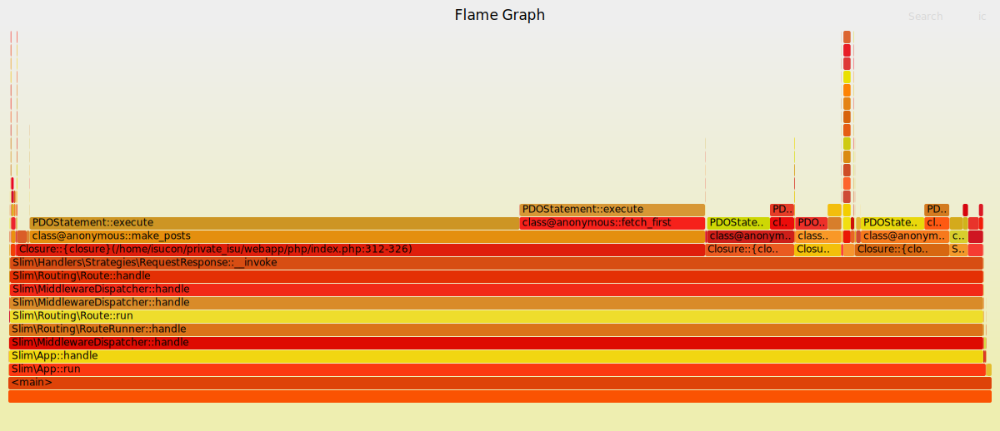

## commentsテーブルへindex追加: 27353点

以下のクエリを実行。

```sql
ALTER TABLE comments ADD INDEX post_id_created_at_idx (post_id, created_at DESC);
```

```sh
{"pass":true,"score":27353,"success":25016,"fail":0,"messages":[]}
```

| COUNT | 1XX |  2XX  | 3XX | 4XX | 5XX | METHOD |          URI          |  MIN  |  MAX  |   SUM   |  AVG  |  P90  |  P95  |  P99  | STDDEV | MIN(BODY) |  MAX(BODY)  |   SUM(BODY)    | AVG(BODY)  |
|-------|-----|-------|-----|-----|-----|--------|-----------------------|-------|-------|---------|-------|-------|-------|-------|--------|-----------|-------------|----------------|------------|
| 13143 | 0   | 13143 | 0   | 0   | 0   | GET    | ^/image/.+            | 0.001 | 0.109 | 347.973 | 0.026 | 0.039 | 0.045 | 0.062 | 0.011  | 36601.000 | 1156481.000 | 4207002421.000 | 320094.531 |
| 1205  | 0   | 1205  | 0   | 0   | 0   | GET    | /                     | 0.024 | 0.160 | 115.632 | 0.096 | 0.115 | 0.122 | 0.138 | 0.016  | 2478.000  | 5871.000    | 3517612.000    | 2919.180   |
| 1522  | 0   | 1522  | 0   | 0   | 0   | GET    | ^/posts/\d+           | 0.002 | 0.110 | 47.371  | 0.031 | 0.043 | 0.049 | 0.063 | 0.010  | 708.000   | 1885.000    | 1939409.000    | 1274.250   |

```sql
# Rank Query ID                            Response time Calls R/Call V/M 
# ==== =================================== ============= ===== ====== ====
#    1 0x4858CF4D8CAA743E839C127C71B69E75  43.3642 39.2%  1205 0.0360  0.00 SELECT posts
#    2 0x19759A5557089FD5B718D440CBBB5C55  14.7213 13.3% 14665 0.0010  0.00 SELECT posts
#    3 0x396201721CD58410E070DA9421CA8C8D  11.6983 10.6% 75608 0.0002  0.00 SELECT users
...
SELECT `id`, `user_id`, `body`, `mime`, `created_at` FROM `posts` ORDER BY `created_at` DESC\G
SELECT * FROM `posts` WHERE `id` = '9951'\G
SELECT * FROM `users` WHERE `id` = '521'\G
```

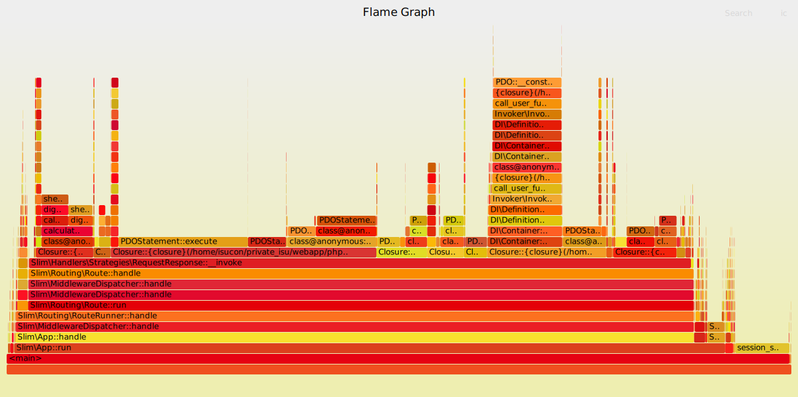

## ユーザの画像をnginxから配信: 57835点

実施したこと: [c38c147](https://github.com/stefafafan/private-isu-php/commit/c38c147e83ba5a3e4a9ad90fbf757eab5049e9b4), [c150c89](https://github.com/stefafafan/private-isu-php/commit/c150c898422cd8133d5e822ad6f225f46dc2925d)

```sh
{"pass":true,"score":57835,"success":55844,"fail":0,"messages":[]}
```

| COUNT | 1XX | 2XX  |  3XX  | 4XX | 5XX | METHOD |        URI         |  MIN  |  MAX  |   SUM   |  AVG  |  P90  |  P95  |  P99  | STDDEV | MIN(BODY) |  MAX(BODY)  |   SUM(BODY)   | AVG(BODY) |
|-------|-----|------|-------|-----|-----|--------|--------------------|-------|-------|---------|-------|-------|-------|-------|--------|-----------|-------------|---------------|-----------|
| 1919  | 0   | 1919 | 0     | 0   | 0   | GET    | /                  | 0.024 | 0.196 | 242.230 | 0.126 | 0.155 | 0.161 | 0.174 | 0.021  | 2568.000  | 5868.000    | 5735867.000   | 2988.987  |
| 600   | 0   | 600  | 0     | 0   | 0   | GET    | /posts             | 0.025 | 0.226 | 92.714  | 0.155 | 0.186 | 0.193 | 0.208 | 0.027  | 5148.000  | 5964.000    | 3315298.000   | 5525.497  |
| 40647 | 0   | 2482 | 38165 | 0   | 0   | GET    | ^/image/.+         | 0.000 | 0.151 | 74.092  | 0.002 | 0.000 | 0.000 | 0.066 | 0.011  | 0.000     | 1156467.000 | 402646247.000 | 9905.928  |


```sql
# Rank Query ID                            Response time Calls  R/Call V/M
# ==== =================================== ============= ====== ====== ===
#    1 0x4858CF4D8CAA743E839C127C71B69E75  78.3924 47.9%   1919 0.0409  0.00 SELECT posts
#    2 0x7A12D0C8F433684C3027353C36CAB572  30.0311 18.3%    600 0.0501  0.00 SELECT posts
#    3 0x396201721CD58410E070DA9421CA8C8D  19.5462 11.9% 122443 0.0002  0.00 SELECT users
...
SELECT `id`, `user_id`, `body`, `mime`, `created_at` FROM `posts` ORDER BY `created_at` DESC\G
SELECT `id`, `user_id`, `body`, `mime`, `created_at` FROM `posts` WHERE `created_at` <= '2016-01-02T11:44:45+09:00' ORDER BY `created_at` DESC\G
SELECT * FROM `users` WHERE `id` = '862'\G
```

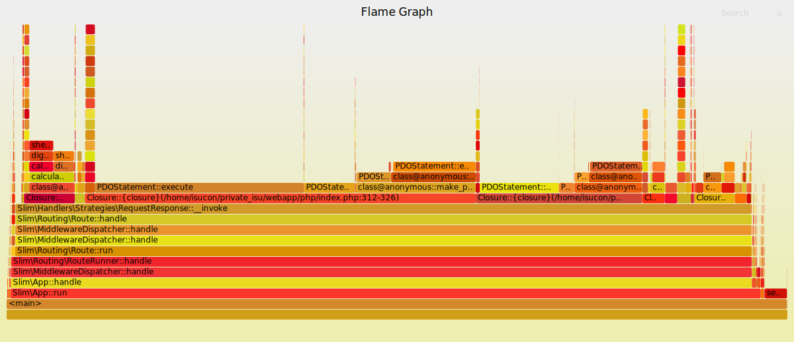

## トップページから呼んでいるクエリの全件取得をやめる + ORDER BY狙いINDEX追加: 93054点

実施したことは [188217a](https://github.com/stefafafan/private-isu-php/commit/188217a69723de5d2e09ad4578b1ff7f5aae74ef) と、以下のINDEX追加:

```sql
ALTER TABLE posts ADD INDEX created_at_idx (created_at DESC);
```

```sh
{"pass":true,"score":93054,"success":90016,"fail":0,"messages":[]}
```

| COUNT | 1XX | 2XX  |  3XX  | 4XX | 5XX | METHOD |        URI         |  MIN  |  MAX  |   SUM   |  AVG  |  P90  |  P95  |  P99  | STDDEV | MIN(BODY) |  MAX(BODY)  |   SUM(BODY)   | AVG(BODY) |
|-------|-----|------|-------|-----|-----|--------|--------------------|-------|-------|---------|-------|-------|-------|-------|--------|-----------|-------------|---------------|-----------|
| 3268  | 0   | 3268 | 0     | 0   | 0   | GET    | /                  | 0.008 | 0.181 | 198.681 | 0.061 | 0.077 | 0.083 | 0.102 | 0.014  | 2408.000  | 5867.000    | 9364326.000   | 2865.461  |
| 770   | 0   | 770  | 0     | 0   | 0   | GET    | /posts             | 0.026 | 0.214 | 109.569 | 0.142 | 0.169 | 0.174 | 0.189 | 0.024  | 5123.000  | 5959.000    | 4257236.000   | 5528.878  |
| 1552  | 0   | 0    | 1552  | 0   | 0   | POST   | /login             | 0.001 | 0.104 | 80.263  | 0.052 | 0.070 | 0.074 | 0.085 | 0.014  | 5.000     | 5.000       | 7760.000      | 5.000     |

```sql
# Rank Query ID                            Response time Calls  R/Call V/M
# ==== =================================== ============= ====== ====== ===
#    1 0x7A12D0C8F433684C3027353C36CAB572  41.5155 33.3%    770 0.0539  0.00 SELECT posts
#    2 0x396201721CD58410E070DA9421CA8C8D  26.7731 21.5% 174747 0.0002  0.00 SELECT users
#    3 0x624863D30DAC59FA16849282195BE09F  15.7744 12.6%  84487 0.0002  0.00 SELECT comments
...
SELECT `id`, `user_id`, `body`, `mime`, `created_at` FROM `posts` WHERE `created_at` <= '2016-01-02T11:46:24+09:00' ORDER BY `created_at` DESC\G
SELECT * FROM `users` WHERE `id` = '58'\G
SELECT * FROM `comments` WHERE `post_id` = '9812' ORDER BY `created_at` DESC LIMIT 3\G
```

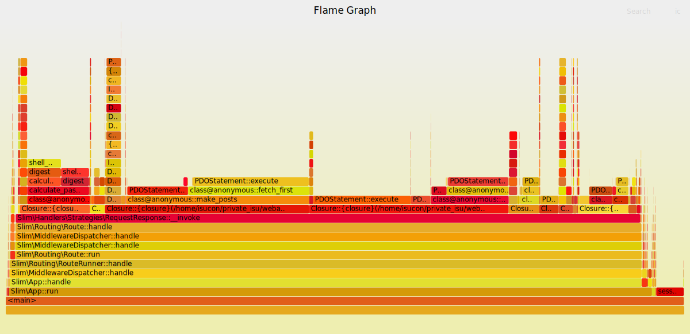

## 他のmake_posts周辺クエリも同様に改善する: 112481点
実施したこと: [4ba3089](https://github.com/stefafafan/private-isu-php/commit/4ba3089cb1814b26bd8eade2a8232800b995cd39), [5022739](https://github.com/stefafafan/private-isu-php/commit/5022739217588edc05e5e1dd9fc996851b1eca3b)

```sh
{"pass":true,"score":112481,"success":109220,"fail":0,"messages":[]}
```

| COUNT | 1XX | 2XX  |  3XX  | 4XX | 5XX | METHOD |        URI         |  MIN  |  MAX  |   SUM   |  AVG  |  P90  |  P95  |  P99  | STDDEV | MIN(BODY) |  MAX(BODY)  |   SUM(BODY)   | AVG(BODY) |
|-------|-----|------|-------|-----|-----|--------|--------------------|-------|-------|---------|-------|-------|-------|-------|--------|-----------|-------------|---------------|-----------|
| 3530  | 0   | 3530 | 0     | 0   | 0   | GET    | /                  | 0.007 | 0.145 | 200.530 | 0.057 | 0.072 | 0.078 | 0.095 | 0.013  | 2538.000  | 22238.000   | 10171918.000  | 2881.563  |
| 1320  | 0   | 1320 | 0     | 0   | 0   | GET    | /posts             | 0.010 | 0.163 | 100.339 | 0.076 | 0.092 | 0.096 | 0.111 | 0.014  | 5153.000  | 5991.000    | 7320225.000   | 5545.625  |
| 1674  | 0   | 0    | 1674  | 0   | 0   | POST   | /login             | 0.002 | 0.089 | 80.399  | 0.048 | 0.064 | 0.068 | 0.078 | 0.013  | 5.000     | 5.000       | 8370.000      | 5.000     |

```sql
# Rank Query ID                            Response time Calls  R/Call V/M
# ==== =================================== ============= ====== ====== ===
#    1 0x396201721CD58410E070DA9421CA8C8D  33.7658 32.1% 227976 0.0001  0.00 SELECT users
#    2 0x624863D30DAC59FA16849282195BE09F  18.6468 17.7% 100698 0.0002  0.00 SELECT comments
#    3 0x422390B42D4DD86C7539A5F45EB76A80  17.8097 16.9% 102654 0.0002  0.00 SELECT comments
...
SELECT * FROM `users` WHERE `id` = '878'\G
SELECT * FROM `comments` WHERE `post_id` = '9916' ORDER BY `created_at` DESC LIMIT 3\G
SELECT COUNT(*) AS `count` FROM `comments` WHERE `post_id` = '936'\G
```

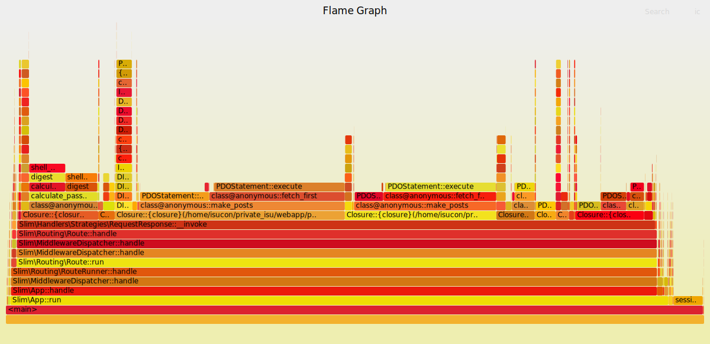

## make_posts内のpostのuserを引いてくるクエリをなくす: 124309点

実施したこと: [3ed1711](https://github.com/stefafafan/private-isu-php/commit/3ed1711b65dd71a3867d94a2d020691cfdf07003)

```sh
{"pass":true,"score":124309,"success":120796,"fail":0,"messages":[]}
```

| COUNT | 1XX | 2XX  |  3XX  | 4XX | 5XX | METHOD |        URI         |  MIN  |  MAX  |   SUM   |  AVG  |  P90  |  P95  |  P99  | STDDEV | MIN(BODY) |  MAX(BODY)  |   SUM(BODY)   | AVG(BODY) |
|-------|-----|------|-------|-----|-----|--------|--------------------|-------|-------|---------|-------|-------|-------|-------|--------|-----------|-------------|---------------|-----------|
| 3913  | 0   | 3913 | 0     | 0   | 0   | GET    | /                  | 0.008 | 0.130 | 189.434 | 0.048 | 0.064 | 0.070 | 0.089 | 0.013  | 2435.000  | 5880.000    | 11391827.000  | 2911.277  |
| 1430  | 0   | 1430 | 0     | 0   | 0   | GET    | /posts             | 0.008 | 0.185 | 99.323  | 0.069 | 0.085 | 0.091 | 0.121 | 0.015  | 5142.000  | 6022.000    | 7913154.000   | 5533.674  |
| 1800  | 0   | 0    | 1800  | 0   | 0   | POST   | /login             | 0.002 | 0.138 | 83.596  | 0.046 | 0.062 | 0.067 | 0.080 | 0.014  | 5.000     | 5.000       | 9000.000      | 5.000     |

```sql
# Rank Query ID                            Response time Calls  R/Call V/M
# ==== =================================== ============= ====== ====== ===
#    1 0x624863D30DAC59FA16849282195BE09F  22.0659 21.7% 110842 0.0002  0.00 SELECT comments
#    2 0x396201721CD58410E070DA9421CA8C8D  21.2831 20.9% 135728 0.0002  0.00 SELECT users
#    3 0x422390B42D4DD86C7539A5F45EB76A80  21.0747 20.7% 113004 0.0002  0.00 SELECT comments
...
SELECT * FROM `comments` WHERE `post_id` = '9879' ORDER BY `created_at` DESC LIMIT 3\G
SELECT * FROM `users` WHERE `id` = '172'\G
SELECT COUNT(*) AS `count` FROM `comments` WHERE `post_id` = '9820'\G
```


## make_posts内のcomment_countのN+1改善: 141431点

実施したこと: [2966fdd](https://github.com/stefafafan/private-isu-php/commit/2966fdd5d8ab97b442e49eece5a6c1a3a8fc9efd)

```sh
{"pass":true,"score":141431,"success":137615,"fail":0,"messages":[]}
```

| COUNT  | 1XX | 2XX  |  3XX  | 4XX | 5XX | METHOD |        URI         |  MIN  |  MAX  |   SUM   |  AVG  |  P90  |  P95  |  P99  | STDDEV | MIN(BODY) |  MAX(BODY)  |   SUM(BODY)   | AVG(BODY) |
|--------|-----|------|-------|-----|-----|--------|--------------------|-------|-------|---------|-------|-------|-------|-------|--------|-----------|-------------|---------------|-----------|
| 4474   | 0   | 4474 | 0     | 0   | 0   | GET    | /                  | 0.004 | 0.095 | 174.277 | 0.039 | 0.052 | 0.057 | 0.069 | 0.010  | 2586.000  | 22488.000   | 12968973.000  | 2898.742  |
| 1620   | 0   | 1620 | 0     | 0   | 0   | GET    | /posts             | 0.006 | 0.132 | 97.146  | 0.060 | 0.076 | 0.082 | 0.094 | 0.013  | 5146.000  | 6065.000    | 8972855.000   | 5538.799  |
| 1971   | 0   | 0    | 1971  | 0   | 0   | POST   | /login             | 0.002 | 0.101 | 87.836  | 0.045 | 0.061 | 0.066 | 0.077 | 0.014  | 5.000     | 5.000       | 9855.000      | 5.000     |

```sql
# Rank Query ID                            Response time Calls  R/Call V/M
# ==== =================================== ============= ====== ====== ===
#    1 0x624863D30DAC59FA16849282195BE09F  25.4541 27.5% 126227 0.0002  0.00 SELECT comments
#    2 0x396201721CD58410E070DA9421CA8C8D  23.1541 25.0% 150099 0.0002  0.00 SELECT users
#    3 0xCDEB1AFF2AE2BE51B2ED5CF03D4E749F  11.7377 12.7%    422 0.0278  0.00 SELECT comments
...
SELECT * FROM `comments` WHERE `post_id` = '9795' ORDER BY `created_at` DESC LIMIT 3\G
SELECT * FROM `users` WHERE `id` = '759'\G
SELECT COUNT(*) AS count FROM `comments` WHERE `user_id` = '908'\G
```

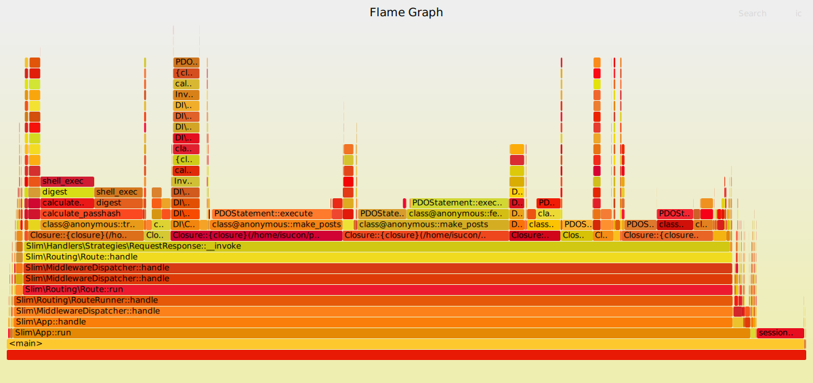

## MySQLのbinlog無効化: 153314点

実施したこと: [5e370eb](https://github.com/stefafafan/private-isu-php/commit/5e370ebbd633fecc0a1e32c66c63b2653e192095)

```sh
{"pass":true,"score":153314,"success":149158,"fail":0,"messages":[]}
```

| COUNT  | 1XX | 2XX  |  3XX   | 4XX | 5XX | METHOD |        URI         |  MIN  |  MAX  |   SUM   |  AVG  |  P90  |  P95  |  P99  | STDDEV | MIN(BODY) |  MAX(BODY)  |   SUM(BODY)   | AVG(BODY) |
|--------|-----|------|--------|-----|-----|--------|--------------------|-------|-------|---------|-------|-------|-------|-------|--------|-----------|-------------|---------------|-----------|
| 4787   | 0   | 4787 | 0      | 0   | 0   | GET    | /                  | 0.006 | 0.112 | 173.843 | 0.036 | 0.049 | 0.054 | 0.066 | 0.010  | 2422.000  | 5881.000    | 13564959.000  | 2833.708  |
| 1710   | 0   | 1710 | 0      | 0   | 0   | GET    | /posts             | 0.006 | 0.150 | 97.299  | 0.057 | 0.071 | 0.076 | 0.086 | 0.012  | 5153.000  | 6016.000    | 9467970.000   | 5536.825  |
| 2135   | 0   | 0    | 2135   | 0   | 0   | POST   | /login             | 0.001 | 0.127 | 88.153  | 0.041 | 0.055 | 0.060 | 0.070 | 0.012  | 5.000     | 5.000       | 10675.000     | 5.000     |

```sql
# Rank Query ID                            Response time Calls  R/Call V/M
# ==== =================================== ============= ====== ====== ===
#    1 0x624863D30DAC59FA16849282195BE09F  27.0061 28.5% 134845 0.0002  0.00 SELECT comments
#    2 0x396201721CD58410E070DA9421CA8C8D  25.1847 26.6% 162195 0.0002  0.00 SELECT users
#    3 0xCDEB1AFF2AE2BE51B2ED5CF03D4E749F  13.8780 14.7%    495 0.0280  0.00 SELECT comments
...
SELECT * FROM `comments` WHERE `post_id` = '1607' ORDER BY `created_at` DESC LIMIT 3\G
SELECT * FROM `users` WHERE `id` = '554'\G
SELECT COUNT(*) AS count FROM `comments` WHERE `user_id` = '660'\G
```

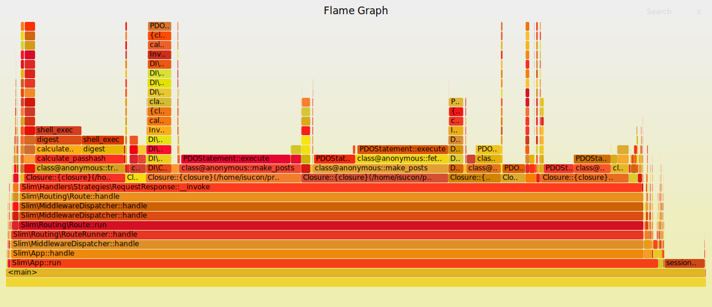

## make_posts内のcommentsのN+1解消: 188721点

実施したこと: [ccb0f52](https://github.com/stefafafan/private-isu-php/commit/ccb0f52d260ad9a25a4711a1b2bd02ad9c05c84f)

```sh
{"pass":true,"score":188721,"success":183801,"fail":0,"messages":[]}
```

| COUNT  | 1XX | 2XX  |  3XX   | 4XX | 5XX | METHOD |        URI         |  MIN  |  MAX  |   SUM   |  AVG  |  P90  |  P95  |  P99  | STDDEV | MIN(BODY) |  MAX(BODY)  |   SUM(BODY)   | AVG(BODY) |
|--------|-----|------|--------|-----|-----|--------|--------------------|-------|-------|---------|-------|-------|-------|-------|--------|-----------|-------------|---------------|-----------|
| 6050   | 0   | 6050 | 0      | 0   | 0   | GET    | /                  | 0.004 | 0.080 | 148.301 | 0.025 | 0.036 | 0.040 | 0.050 | 0.009  | 2480.000  | 5872.000    | 16882666.000  | 2790.523  |
| 2000   | 0   | 2000 | 0      | 0   | 0   | GET    | /posts             | 0.005 | 0.091 | 94.169  | 0.047 | 0.060 | 0.065 | 0.074 | 0.011  | 5156.000  | 6012.000    | 11093922.000  | 5546.961  |
| 2532   | 0   | 0    | 2532   | 0   | 0   | POST   | /login             | 0.001 | 0.079 | 94.127  | 0.037 | 0.051 | 0.055 | 0.064 | 0.011  | 5.000     | 5.000       | 12660.000     | 5.000     |

```sql
# Rank Query ID                            Response time Calls  R/Call V/M
# ==== =================================== ============= ====== ====== ===
#    1 0x396201721CD58410E070DA9421CA8C8D  27.2668 33.6% 184960 0.0001  0.00 SELECT users
#    2 0xCDEB1AFF2AE2BE51B2ED5CF03D4E749F  16.1095 19.9%    552 0.0292  0.00 SELECT comments
#    3 0xB404C51243E51A86EF50167151FA4238  12.3547 15.2%    552 0.0224  0.00 SELECT posts users
...
SELECT * FROM `users` WHERE `id` = '928'\G
SELECT COUNT(*) AS count FROM `comments` WHERE `user_id` = '920'\G
SELECT `posts`.`id`, `posts`.`user_id`, `posts`.`body`, `posts`.`mime`, `posts`.`created_at`, `users`.`account_name` FROM `posts` JOIN `users` ON `posts`.`user_id` = `users`.`id` WHERE `users`.`del_flg` = 0 AND `posts`.`user_id` = '221' ORDER BY `posts`.`created_at` DESC LIMIT 20\G
```

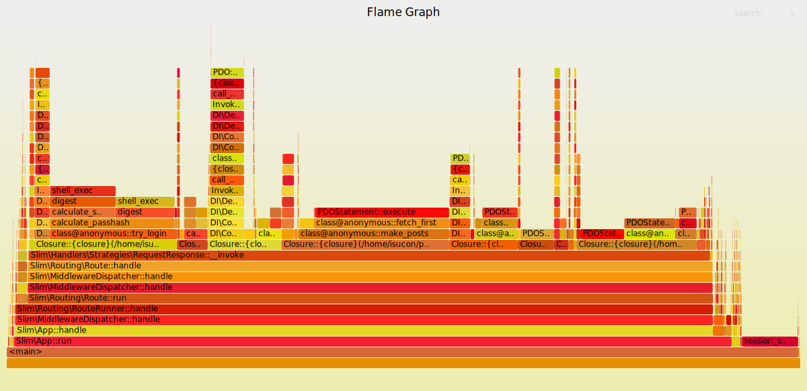

## make_posts内の最後のN+1解消: 226115点

実施したこと: [3c3d4f6](https://github.com/stefafafan/private-isu-php/commit/3c3d4f62dd254cf733c8e412ada4c9af8b2d8fa2)

```sh
{"pass":true,"score":226115,"success":220979,"fail":0,"messages":[]}
```

| COUNT  | 1XX | 2XX  |  3XX   | 4XX | 5XX | METHOD |        URI         |  MIN  |  MAX  |   SUM   |  AVG  |  P90  |  P95  |  P99  | STDDEV | MIN(BODY) |  MAX(BODY)  |   SUM(BODY)   | AVG(BODY) |
|--------|-----|------|--------|-----|-----|--------|--------------------|-------|-------|---------|-------|-------|-------|-------|--------|-----------|-------------|---------------|-----------|
| 6510   | 0   | 6510 | 0      | 0   | 0   | GET    | /                  | 0.002 | 0.095 | 142.244 | 0.022 | 0.031 | 0.034 | 0.044 | 0.007  | 2472.000  | 5882.000    | 18335079.000  | 2816.448  |
| 2688   | 0   | 0    | 2688   | 0   | 0   | POST   | /login             | 0.001 | 0.107 | 97.578  | 0.036 | 0.050 | 0.055 | 0.072 | 0.013  | 5.000     | 5.000       | 13440.000     | 5.000     |
| 3070   | 0   | 3070 | 0      | 0   | 0   | GET    | /posts             | 0.003 | 0.106 | 78.589  | 0.026 | 0.035 | 0.039 | 0.050 | 0.008  | 5148.000  | 6043.000    | 17015242.000  | 5542.424  |

```sql
# Rank Query ID                            Response time Calls R/Call V/M 
# ==== =================================== ============= ===== ====== ====
#    1 0xCDEB1AFF2AE2BE51B2ED5CF03D4E749F  19.8348 27.8%   640 0.0310  0.00 SELECT comments
#    2 0xB404C51243E51A86EF50167151FA4238  15.6404 21.9%   640 0.0244  0.00 SELECT posts users
#    3 0x6043518FB89B720C84648F90F3DA0885   9.3744 13.1% 13988 0.0007  0.00 SELECT comments
...
SELECT COUNT(*) AS count FROM `comments` WHERE `user_id` = '340'\G
SELECT `posts`.`id`, `posts`.`user_id`, `posts`.`body`, `posts`.`mime`, `posts`.`created_at`, `users`.`account_name` FROM `posts` JOIN `users` ON `posts`.`user_id` = `users`.`id` WHERE `users`.`del_flg` = 0 AND `posts`.`user_id` = '571' ORDER BY `posts`.`created_at` DESC LIMIT 20\G
SELECT * FROM `comments` WHERE `post_id` IN ('9941','9940','9939','9938','9937','9936','9935','9934','9933','9932','9931','9930','9929','9928','9926','9925','9924','9923','9922','9921') ORDER BY `created_at` DESC\G
```

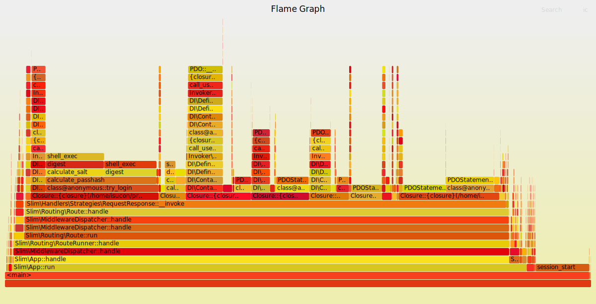

## 外部コマンド呼び出しをやめる: 257402点

実施したこと: [f5cafb9](https://github.com/stefafafan/private-isu-php/commit/f5cafb95977b95c738d5ef797ebd8ddd0c68aed4)

```sh
{"pass":true,"score":257402,"success":250371,"fail":0,"messages":[]}
```

| COUNT  | 1XX | 2XX  |  3XX   | 4XX | 5XX | METHOD |        URI         |  MIN  |  MAX  |   SUM   |  AVG  |  P90  |  P95  |  P99  | STDDEV | MIN(BODY) |  MAX(BODY)  |   SUM(BODY)   | AVG(BODY) |
|--------|-----|------|--------|-----|-----|--------|--------------------|-------|-------|---------|-------|-------|-------|-------|--------|-----------|-------------|---------------|-----------|
| 7919   | 0   | 7919 | 0      | 0   | 0   | GET    | /                  | 0.002 | 0.058 | 147.219 | 0.019 | 0.026 | 0.029 | 0.037 | 0.006  | 2431.000  | 5873.000    | 21578688.000  | 2724.926  |
| 3330   | 0   | 3330 | 0      | 0   | 0   | GET    | /posts             | 0.004 | 0.054 | 74.840  | 0.022 | 0.030 | 0.033 | 0.041 | 0.006  | 5175.000  | 6095.000    | 18473833.000  | 5547.698  |
| 4263   | 0   | 4263 | 0      | 0   | 0   | GET    | ^/posts/\d+        | 0.002 | 0.052 | 74.010  | 0.017 | 0.025 | 0.028 | 0.034 | 0.006  | 696.000   | 1899.000    | 5473777.000   | 1284.020  |

```sql
# Rank Query ID                            Response time Calls R/Call V/M 
# ==== =================================== ============= ===== ====== ====
#    1 0xCDEB1AFF2AE2BE51B2ED5CF03D4E749F  23.0160 26.2%   754 0.0305  0.00 SELECT comments
#    2 0xB404C51243E51A86EF50167151FA4238  17.9875 20.5%   754 0.0239  0.00 SELECT posts users
#    3 0x6043518FB89B720C84648F90F3DA0885  11.4907 13.1% 16266 0.0007  0.00 SELECT comments
...
SELECT COUNT(*) AS count FROM `comments` WHERE `user_id` = '805'\G
SELECT `posts`.`id`, `posts`.`user_id`, `posts`.`body`, `posts`.`mime`, `posts`.`created_at`, `users`.`account_name` FROM `posts` JOIN `users` ON `posts`.`user_id` = `users`.`id` WHERE `users`.`del_flg` = 0 AND `posts`.`user_id` = '805' ORDER BY `posts`.`created_at` DESC LIMIT 20\G
SELECT * FROM `comments` WHERE `post_id` IN ('9617','9405','9172','8910','8878','8415','7314','7197','4996','4918','4102','4004','3878','3576','1226','832','772','123') ORDER BY `created_at` DESC\G
```

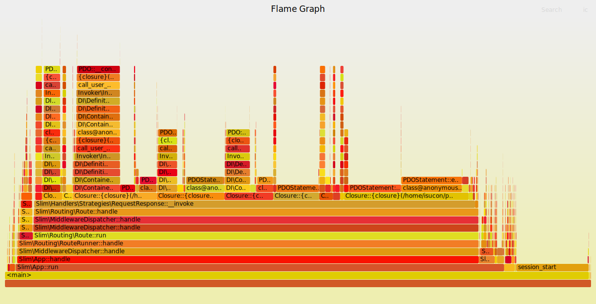

## comments.user_id へのINDEX追加: 272468点

以下のINDEXを追加した。

```sql
ALTER TABLE comments ADD INDEX user_id_idx (user_id);
```

```sh
{"pass":true,"score":272468,"success":264451,"fail":0,"messages":[]}
```

| COUNT  | 1XX |  2XX  |  3XX   | 4XX  | 5XX | METHOD |        URI         |  MIN  |  MAX  |   SUM   |  AVG  |  P90  |  P95  |  P99  | STDDEV | MIN(BODY) |  MAX(BODY)  |   SUM(BODY)    | AVG(BODY) |
|--------|-----|-------|--------|------|-----|--------|--------------------|-------|-------|---------|-------|-------|-------|-------|--------|-----------|-------------|----------------|-----------|
| 16408  | 0   | 16408 | 0      | 0    | 0   | GET    | /                  | 0.002 | 0.766 | 291.837 | 0.018 | 0.025 | 0.028 | 0.035 | 0.012  | 2386.000  | 5887.000    | 45170991.000   | 2752.986  |
| 9403   | 0   | 9403  | 0      | 0    | 0   | GET    | ^/posts/\d+        | 0.001 | 0.103 | 153.433 | 0.016 | 0.023 | 0.026 | 0.032 | 0.006  | 696.000   | 1977.000    | 12050499.000   | 1281.559  |
| 6760   | 0   | 6760  | 0      | 0    | 0   | GET    | /posts             | 0.004 | 0.270 | 144.783 | 0.021 | 0.029 | 0.032 | 0.038 | 0.007  | 5156.000  | 6095.000    | 37506282.000   | 5548.267  |


```sql
# Rank Query ID                            Response time Calls R/Call V/M 
# ==== =================================== ============= ===== ====== ====
#    1 0xB404C51243E51A86EF50167151FA4238  38.8360 23.5%  1701 0.0228  0.00 SELECT posts users
#    2 0x6043518FB89B720C84648F90F3DA0885  24.6736 15.0% 34272 0.0007  0.00 SELECT comments
#    3 0xCDEB1AFF2AE2BE51B2ED5CF03D4E749F  23.3410 14.2%  1701 0.0137  0.02 SELECT comments
...
SELECT `posts`.`id`, `posts`.`user_id`, `posts`.`body`, `posts`.`mime`, `posts`.`created_at`, `users`.`account_name` FROM `posts` JOIN `users` ON `posts`.`user_id` = `users`.`id` WHERE `users`.`del_flg` = 0 AND `posts`.`user_id` = '280' ORDER BY `posts`.`created_at` DESC LIMIT 20\G
SELECT * FROM `comments` WHERE `post_id` IN ('12627','10000','9999','9998','9997','9996','9995','9994','9993','9991','9990','9989','9988','9987','9986','9985','9983','9982','9981','9980') ORDER BY `created_at` DESC\G
SELECT COUNT(*) AS count FROM `comments` WHERE `user_id` = '805'\G
```

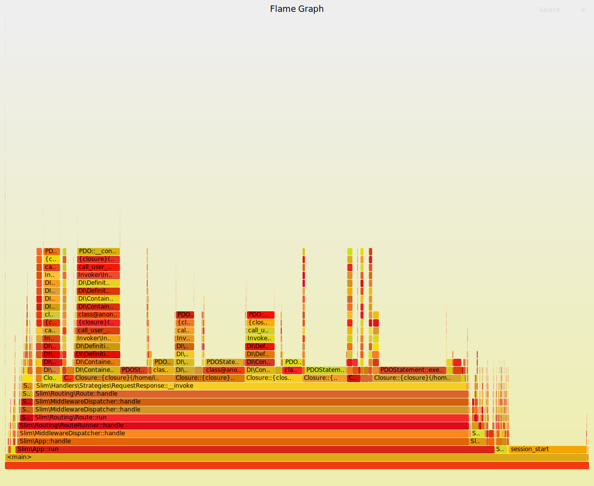

## INDEXの追加とFORCE INDEXの指定: 326587点

以下のINDEXを追加したのと、クエリにFORCE INDEXの指定を追加: [5cb2db1](https://github.com/stefafafan/private-isu-php/commit/5cb2db12f44b7f321f78f7ec3c1daeb3175b5ceb)
```sql
ALTER TABLE posts ADD INDEX user_id_created_at_idx (user_id, created_at DESC);
```

```sh
{"pass":true,"score":326587,"success":316744,"fail":0,"messages":[]}
```

| COUNT  | 1XX |  2XX  |  3XX   | 4XX | 5XX | METHOD |        URI         |  MIN  |  MAX  |   SUM   |  AVG  |  P90  |  P95  |  P99  | STDDEV | MIN(BODY)  |  MAX(BODY)  |   SUM(BODY)    | AVG(BODY) |
|--------|-----|-------|--------|-----|-----|--------|--------------------|-------|-------|---------|-------|-------|-------|-------|--------|------------|-------------|----------------|-----------|
| 10174  | 0   | 10174 | 0      | 0   | 0   | GET    | /                  | 0.002 | 0.045 | 137.050 | 0.013 | 0.018 | 0.020 | 0.025 | 0.004  | 2436.000   | 22470.000   | 27920401.000   | 2744.289  |
| 7003   | 0   | 7003  | 0      | 0   | 0   | GET    | ^/posts/\d+        | 0.001 | 0.053 | 90.457  | 0.013 | 0.018 | 0.019 | 0.024 | 0.004  | 683.000    | 1978.000    | 9012785.000    | 1286.989  |
| 3990   | 0   | 3990  | 0      | 0   | 0   | GET    | /posts             | 0.004 | 0.056 | 66.438  | 0.017 | 0.022 | 0.023 | 0.031 | 0.004  | 5155.000   | 6040.000    | 22121039.000   | 5544.120  |

```sql
# Rank Query ID                            Response time Calls R/Call V/M 
# ==== =================================== ============= ===== ====== ====
#    1 0x6043518FB89B720C84648F90F3DA0885  13.2150 25.2% 22516 0.0006  0.00 SELECT comments
#    2 0x009A61E5EFBD5A5E4097914B4DBD1C07  11.9039 22.7%   368 0.0323  0.02 INSERT posts
#    3 0x5C29F616FBA5526D7150C7847FA60150   8.8644 16.9% 16448 0.0005  0.00 SELECT users
...
SELECT * FROM `comments` WHERE `post_id` IN ('9825','9824','9823','9822','9821','9820','9819','9818','9817','9816','9815','9814','9813','9812','9811','9810','9809','9808','9807','9806') ORDER BY `created_at` DESC\G
INSERT INTO `posts` (`user_id`, `mime`, `imgdata`, `body`) VALUES...
SELECT * FROM `users` WHERE `id` IN ('137','766','640','610','816','377','103','359','789','811','375','544','396','770','107','793','934','54','598','964'/*... omitted 177 items ...*/)\G
```

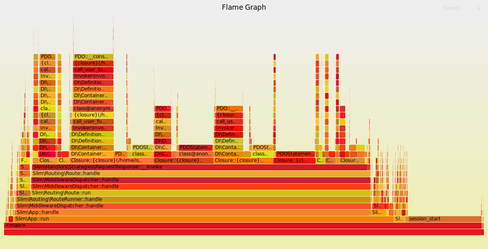

## MySQLの設定チューニング: 320129点

実施したこと: [405ad45](https://github.com/stefafafan/private-isu-php/commit/405ad450a48f710f191c15136c51bf2a3e298d5e)

```sh
{"pass":true,"score":320129,"success":310313,"fail":0,"messages":[]}
```

| COUNT  | 1XX |  2XX  |  3XX   | 4XX | 5XX | METHOD |        URI         |  MIN  |  MAX  |   SUM   |  AVG  |  P90  |  P95  |  P99  | STDDEV | MIN(BODY) |  MAX(BODY)  |   SUM(BODY)    | AVG(BODY) |
|--------|-----|-------|--------|-----|-----|--------|--------------------|-------|-------|---------|-------|-------|-------|-------|--------|-----------|-------------|----------------|-----------|
| 10103  | 0   | 10103 | 0      | 0   | 0   | GET    | /                  | 0.002 | 0.053 | 141.913 | 0.014 | 0.019 | 0.022 | 0.029 | 0.005  | 2482.000  | 5873.000    | 28011209.000   | 2772.563  |
| 6879   | 0   | 6879  | 0      | 0   | 0   | GET    | ^/posts/\d+        | 0.001 | 0.047 | 92.141  | 0.013 | 0.018 | 0.021 | 0.026 | 0.004  | 698.000   | 2098.000    | 8832243.000    | 1283.943  |
| 3890   | 0   | 3890  | 0      | 0   | 0   | GET    | /posts             | 0.004 | 0.056 | 67.471  | 0.017 | 0.023 | 0.025 | 0.033 | 0.005  | 5136.000  | 6017.000    | 21587456.000   | 5549.475  |

```sql
# Rank Query ID                            Response time Calls R/Call V/M 
# ==== =================================== ============= ===== ====== ====
#    1 0x6043518FB89B720C84648F90F3DA0885  13.0345 25.7% 22229 0.0006  0.00 SELECT comments
#    2 0x5C29F616FBA5526D7150C7847FA60150   9.1998 18.2% 17306 0.0005  0.00 SELECT users
#    3 0x009A61E5EFBD5A5E4097914B4DBD1C07   9.0662 17.9%   358 0.0253  0.02 INSERT posts
...
SELECT * FROM `comments` WHERE `post_id` IN ('7661','6526','5055','4408','4113','2864','1972','1907','1836','1165','563','295') ORDER BY `created_at` DESC\G
SELECT * FROM `users` WHERE `id` IN ('233','289','902','610','781','11','416','379','654','508','936','53','184','95','672','39','772','273','898','45'/*... omitted 192 items ...*/)\G
INSERT INTO `posts` (`user_id`, `mime`, `imgdata`, `body`) VALUES...
```

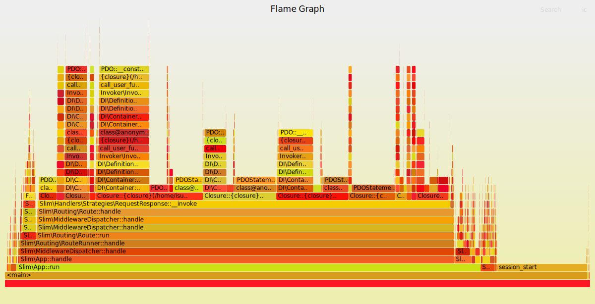

## 静的ファイルをnginxから配信: 323388点

実施したこと: [13ac48b](https://github.com/stefafafan/private-isu-php/commit/13ac48b6a8a2577526221160a35668a559566f79)

```sh
{"pass":true,"score":323388,"success":313519,"fail":0,"messages":[]}
```

| COUNT  | 1XX |  2XX  |  3XX   | 4XX | 5XX | METHOD |        URI         |  MIN  |  MAX  |   SUM   |  AVG  |  P90  |  P95  |  P99  | STDDEV | MIN(BODY) |  MAX(BODY)  |   SUM(BODY)    | AVG(BODY) |
|--------|-----|-------|--------|-----|-----|--------|--------------------|-------|-------|---------|-------|-------|-------|-------|--------|-----------|-------------|----------------|-----------|
| 10189  | 0   | 10189 | 0      | 0   | 0   | GET    | /                  | 0.002 | 0.042 | 141.546 | 0.014 | 0.019 | 0.021 | 0.025 | 0.004  | 2414.000  | 5877.000    | 28070112.000   | 2754.943  |
| 6964   | 0   | 6964  | 0      | 0   | 0   | GET    | ^/posts/\d+        | 0.001 | 0.041 | 92.814  | 0.013 | 0.018 | 0.020 | 0.025 | 0.004  | 691.000   | 2027.000    | 8945720.000    | 1284.566  |
| 3910   | 0   | 3910  | 0      | 0   | 0   | GET    | /posts             | 0.003 | 0.048 | 67.329  | 0.017 | 0.022 | 0.024 | 0.030 | 0.004  | 5141.000  | 6036.000    | 21633570.000   | 5532.882  |

```sql
# Rank Query ID                            Response time Calls R/Call V/M 
# ==== =================================== ============= ===== ====== ====
#    1 0x6043518FB89B720C84648F90F3DA0885  13.0931 29.5% 22435 0.0006  0.00 SELECT comments
#    2 0x5C29F616FBA5526D7150C7847FA60150   9.4684 21.3% 17873 0.0005  0.00 SELECT users
#    3 0x009A61E5EFBD5A5E4097914B4DBD1C07   9.2604 20.9%   363 0.0255  0.02 INSERT posts
...
SELECT * FROM `comments` WHERE `post_id` IN ('8958','8784','7258','7080','5819','4635','4444','2231','741','99') ORDER BY `created_at` DESC\G
SELECT * FROM `users` WHERE `id` IN ('410','617','529','39','772','273','898','45','611','740','528','136','711','116','446','928','105','898','292','686'/*... omitted 175 items ...*/)\G
INSERT INTO `posts` (`user_id`, `mime`, `imgdata`, `body`) VALUES...
```

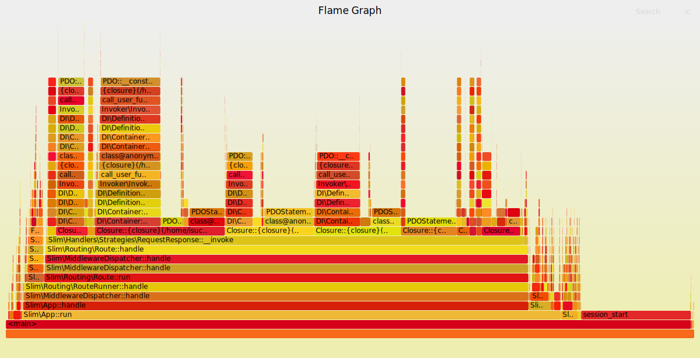

## nginxのworker_connections増やしたりgzipの設定を追加したり: 322611点

実施したこと: [3e7692c](https://github.com/stefafafan/private-isu-php/commit/3e7692c966f4f5c0f4d445abe22f2405bda8db1c)

```sh
{"pass":true,"score":322611,"success":312396,"fail":0,"messages":[]}
```

| COUNT  | 1XX |  2XX  |  3XX   | 4XX | 5XX | METHOD |        URI         |  MIN  |  MAX  |   SUM   |  AVG  |  P90  |  P95  |  P99  | STDDEV | MIN(BODY) |  MAX(BODY)  |   SUM(BODY)    | AVG(BODY) |
|--------|-----|-------|--------|-----|-----|--------|--------------------|-------|-------|---------|-------|-------|-------|-------|--------|-----------|-------------|----------------|-----------|
| 10260  | 0   | 10260 | 0      | 0   | 0   | GET    | /                  | 0.002 | 0.053 | 138.246 | 0.013 | 0.019 | 0.021 | 0.026 | 0.004  | 2192.000  | 5019.000    | 24791841.000   | 2416.359  |
| 7126   | 0   | 7126  | 0      | 0   | 0   | GET    | ^/posts/\d+        | 0.002 | 0.055 | 92.144  | 0.013 | 0.018 | 0.020 | 0.024 | 0.004  | 630.000   | 1881.000    | 8478509.000    | 1189.799  |
| 3850   | 0   | 3850  | 0      | 0   | 0   | GET    | /posts             | 0.004 | 0.061 | 64.902  | 0.017 | 0.022 | 0.024 | 0.031 | 0.005  | 4475.000  | 5228.000    | 18461669.000   | 4795.239  |

```sql
# Rank Query ID                            Response time Calls R/Call V/M 
# ==== =================================== ============= ===== ====== ====
#    1 0x6043518FB89B720C84648F90F3DA0885  12.8667 29.6% 22647 0.0006  0.00 SELECT comments
#    2 0x009A61E5EFBD5A5E4097914B4DBD1C07   8.9613 20.6%   381 0.0235  0.02 INSERT posts
#    3 0x5C29F616FBA5526D7150C7847FA60150   8.8489 20.4% 16151 0.0005  0.00 SELECT users
...
SELECT * FROM `comments` WHERE `post_id` IN ('9867','9866','9865','9864','9863','9862','9861','9860','9858','9857','9856','9855','9854','9853','9852','9851','9850','9849','9848','9847') ORDER BY `created_at` DESC\G
INSERT INTO `posts` (`user_id`, `mime`, `imgdata`, `body`) VALUES...
SELECT * FROM `users` WHERE `id` IN ('563','703','306','893','510','671','835','281','686','711','467','246','617','211','162','998','872','230','421','666'/*... omitted 175 items ...*/)\G
```

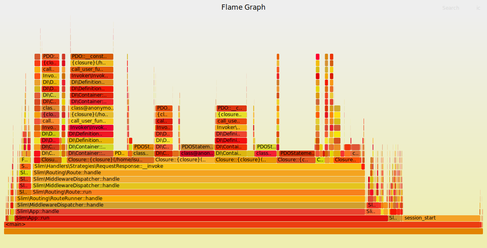

## ベンチマーカーインスタンスのファイルディスクリプタを増やす: 327821点

```sh
{"pass":true,"score":327821,"success":317650,"fail":0,"messages":[]}
```

| COUNT  | 1XX |  2XX  |  3XX   | 4XX | 5XX | METHOD |        URI         |  MIN  |  MAX  |   SUM   |  AVG  |  P90  |  P95  |  P99  | STDDEV | MIN(BODY) |  MAX(BODY)  |   SUM(BODY)    | AVG(BODY) |
|--------|-----|-------|--------|-----|-----|--------|--------------------|-------|-------|---------|-------|-------|-------|-------|--------|-----------|-------------|----------------|-----------|
| 10369  | 0   | 10369 | 0      | 0   | 0   | GET    | /                  | 0.002 | 0.045 | 140.973 | 0.014 | 0.019 | 0.021 | 0.026 | 0.004  | 2153.000  | 5017.000    | 24790373.000   | 2390.816  |
| 7144   | 0   | 7144  | 0      | 0   | 0   | GET    | ^/posts/\d+        | 0.001 | 0.045 | 93.421  | 0.013 | 0.018 | 0.020 | 0.025 | 0.004  | 629.000   | 1870.000    | 8537694.000    | 1195.086  |
| 3940   | 0   | 3940  | 0      | 0   | 0   | GET    | /posts             | 0.003 | 0.048 | 66.576  | 0.017 | 0.022 | 0.024 | 0.031 | 0.005  | 4419.000  | 5192.000    | 18889259.000   | 4794.228  |

```sql
# Rank Query ID                            Response time Calls R/Call V/M 
# ==== =================================== ============= ===== ====== ====
#    1 0x6043518FB89B720C84648F90F3DA0885  13.0108 29.7% 22837 0.0006  0.00 SELECT comments
#    2 0x009A61E5EFBD5A5E4097914B4DBD1C07   9.0545 20.7%   375 0.0241  0.02 INSERT posts
#    3 0x5C29F616FBA5526D7150C7847FA60150   8.8735 20.3% 16045 0.0006  0.00 SELECT users
...
SELECT * FROM `comments` WHERE `post_id` IN ('9803','9802','9801','9800','9799','9798','9797','9796','9795','9794','9793','9792','9791','9790','9789','9788','9787','9786','9785','9784') ORDER BY `created_at` DESC\G
INSERT INTO `posts` (`user_id`, `mime`, `imgdata`, `body`) VALUES...
SELECT * FROM `users` WHERE `id` IN ('540','87','679','807','39','772','273','898','45','532','145','611','740','528','255','136','711','116','446','831'/*... omitted 184 items ...*/)\G
```

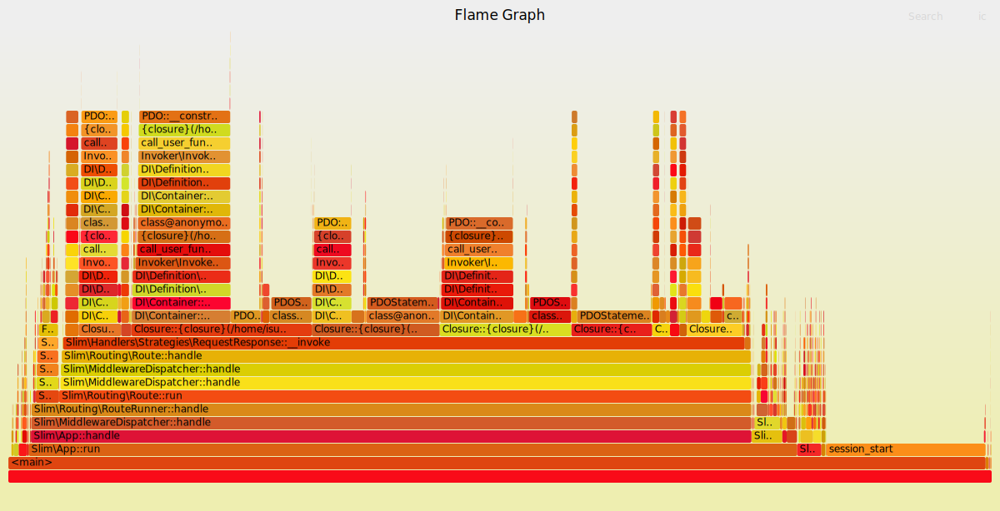

## opcache.jit 有効化: 329357点

実施したこと: [6fdeaaa](https://github.com/stefafafan/private-isu-php/commit/6fdeaaa91fac88d7afde9ed29fafa1e45081208c)

```sh
{"pass":true,"score":329357,"success":319247,"fail":0,"messages":[]}
```

| COUNT  | 1XX |  2XX  |  3XX   | 4XX | 5XX | METHOD |        URI         |  MIN  |  MAX  |   SUM   |  AVG  |  P90  |  P95  |  P99  | STDDEV | MIN(BODY) |  MAX(BODY)  |   SUM(BODY)    | AVG(BODY) |
|--------|-----|-------|--------|-----|-----|--------|--------------------|-------|-------|---------|-------|-------|-------|-------|--------|-----------|-------------|----------------|-----------|
| 10384  | 0   | 10384 | 0      | 0   | 0   | GET    | /                  | 0.002 | 0.045 | 139.535 | 0.013 | 0.019 | 0.020 | 0.024 | 0.004  | 2156.000  | 5018.000    | 25080812.000   | 2415.332  |
| 7170   | 0   | 7170  | 0      | 0   | 0   | GET    | ^/posts/\d+        | 0.002 | 0.040 | 93.608  | 0.013 | 0.018 | 0.019 | 0.023 | 0.004  | 637.000   | 1843.000    | 8533302.000    | 1190.140  |
| 3980   | 0   | 3980  | 0      | 0   | 0   | GET    | /posts             | 0.002 | 0.052 | 66.608  | 0.017 | 0.022 | 0.024 | 0.028 | 0.004  | 4470.000  | 5250.000    | 19143234.000   | 4809.858  |

```sql
# Rank Query ID                            Response time Calls R/Call V/M 
# ==== =================================== ============= ===== ====== ====
#    1 0x6043518FB89B720C84648F90F3DA0885  12.9110 29.5% 22936 0.0006  0.00 SELECT comments
#    2 0x009A61E5EFBD5A5E4097914B4DBD1C07   9.4662 21.6%   370 0.0256  0.02 INSERT posts
#    3 0x5C29F616FBA5526D7150C7847FA60150   8.4182 19.3% 14598 0.0006  0.00 SELECT users
...
SELECT * FROM `comments` WHERE `post_id` IN ('9961','9960','9958','9957','9956','9955','9954','9953','9952','9951','9950','9949','9948','9947','9946','9945','9944','9943','9942','9941') ORDER BY `created_at` DESC\G
INSERT INTO `posts` (`user_id`, `mime`, `imgdata`, `body`) VALUES...
SELECT * FROM `users` WHERE `id` IN ('22','647','228','787','844','197','274','68','168','865','62','246','425','874','297','223','795','355','971','752'/*... omitted 177 items ...*/)\G
```

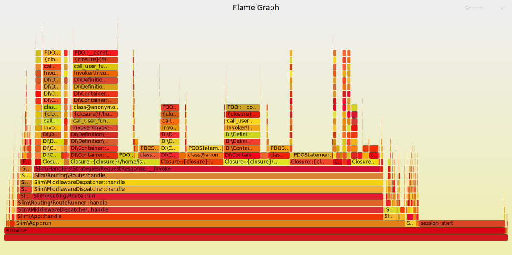

## PHP 8.4 へバージョンアップ (&& reliプロファイラ実行をやめる): 438270点

php8.3-fpm を php8.4-fpm へバージョンアップ。そして reli-prof は PHP 8.4 未対応なので、ベンチ実行中に実行するのをやめました。

```sh
{"pass":true,"score":438270,"success":423963,"fail":0,"messages":[]}
```

| COUNT  | 1XX |  2XX  |  3XX   | 4XX  | 5XX | METHOD |        URI         |  MIN  |  MAX  |   SUM   |  AVG  |  P90  |  P95  |  P99  | STDDEV | MIN(BODY) |  MAX(BODY)  |   SUM(BODY)    | AVG(BODY) |
|--------|-----|-------|--------|------|-----|--------|--------------------|-------|-------|---------|-------|-------|-------|-------|--------|-----------|-------------|----------------|-----------|
| 14052  | 0   | 14052 | 0      | 0    | 0   | GET    | /                  | 0.001 | 0.076 | 120.300 | 0.009 | 0.012 | 0.013 | 0.017 | 0.003  | 2174.000  | 5032.000    | 33988225.000   | 2418.746  |
| 10309  | 0   | 10309 | 0      | 0    | 0   | GET    | ^/posts/\d+        | 0.001 | 0.075 | 83.901  | 0.008 | 0.011 | 0.013 | 0.016 | 0.003  | 638.000   | 1892.000    | 12335122.000   | 1196.539  |
| 5080   | 0   | 5080  | 0      | 0    | 0   | GET    | /posts             | 0.003 | 0.077 | 57.788  | 0.011 | 0.015 | 0.016 | 0.020 | 0.003  | 4483.000  | 5203.000    | 24392453.000   | 4801.664  |

```sql
# Rank Query ID                            Response time Calls R/Call V/M
# ==== =================================== ============= ===== ====== ====
#    1 0x6043518FB89B720C84648F90F3DA0885  15.0490 27.5% 31489 0.0005  0.00 SELECT comments
#    2 0x009A61E5EFBD5A5E4097914B4DBD1C07  12.5106 22.8%   482 0.0260  0.02 INSERT posts
#    3 0x5C29F616FBA5526D7150C7847FA60150  11.3061 20.6% 22810 0.0005  0.00 SELECT users
...
SELECT * FROM `comments` WHERE `post_id` IN ('9967','9966','9965','9964','9963','9962','9961','9960','9958','9957','9956','9955','9954','9953','9952','9951','9950','9949','9948','9947') ORDER BY `created_at` DESC\G
INSERT INTO `posts` (`user_id`, `mime`, `imgdata`, `body`) VALUES...
SELECT * FROM `users` WHERE `id` IN ('359','731','352','907','308','738','477','587','49','513','635','838','620','343','281','713','529','846','939','702'/*... omitted 190 items ...*/)\G
```

## PHP 8.4でもJIT有効化を試みる: 433228点

実施したこと: [f042155](https://github.com/stefafafan/private-isu-php/commit/f0421551ae8396c8bedba2b40365669a796934d4)

```sh
{"pass":true,"score":433228,"success":418901,"fail":0,"messages":[]}
```

| COUNT  | 1XX |  2XX  |  3XX   | 4XX  | 5XX | METHOD |        URI         |  MIN  |  MAX  |   SUM   |  AVG  |  P90  |  P95  |  P99  | STDDEV | MIN(BODY) |  MAX(BODY)  |   SUM(BODY)    | AVG(BODY) |
|--------|-----|-------|--------|------|-----|--------|--------------------|-------|-------|---------|-------|-------|-------|-------|--------|-----------|-------------|----------------|-----------|
| 13997  | 0   | 13997 | 0      | 0    | 0   | GET    | /                  | 0.001 | 0.027 | 117.651 | 0.008 | 0.012 | 0.013 | 0.016 | 0.003  | 2131.000  | 5030.000    | 33693488.000   | 2407.194  |
| 10329  | 0   | 10329 | 0      | 0    | 0   | GET    | ^/posts/\d+        | 0.001 | 0.030 | 82.458  | 0.008 | 0.011 | 0.012 | 0.015 | 0.003  | 639.000   | 1888.000    | 12321752.000   | 1192.928  |
| 5030   | 0   | 5030  | 0      | 0    | 0   | GET    | /posts             | 0.002 | 0.033 | 56.208  | 0.011 | 0.015 | 0.016 | 0.019 | 0.003  | 4482.000  | 5262.000    | 24192538.000   | 4809.650  |

```sql
# Rank Query ID                            Response time Calls R/Call V/M 
# ==== =================================== ============= ===== ====== ====
#    1 0x6043518FB89B720C84648F90F3DA0885  15.1224 27.5% 31423 0.0005  0.00 SELECT comments
#    2 0x009A61E5EFBD5A5E4097914B4DBD1C07  13.1430 23.9%   499 0.0263  0.02 INSERT posts
#    3 0x5C29F616FBA5526D7150C7847FA60150  11.9740 21.7% 24361 0.0005  0.00 SELECT users
...
SELECT * FROM `comments` WHERE `post_id` IN ('9821','9820','9819','9818','9817','9816','9815','9814','9813','9812','9811','9810','9809','9808','9807','9806','9805','9804','9803','9802') ORDER BY `created_at` DESC\G
INSERT INTO `posts` (`user_id`, `mime`, `imgdata`, `body`) VALUES...
SELECT * FROM `users` WHERE `id` IN ('236','591','227','554','958','992','496','671','58','835','281','686','832','542','467','246','211','162','998','872'/*... omitted 185 items ...*/)\G
```
