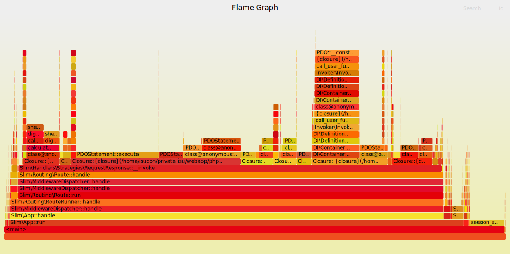
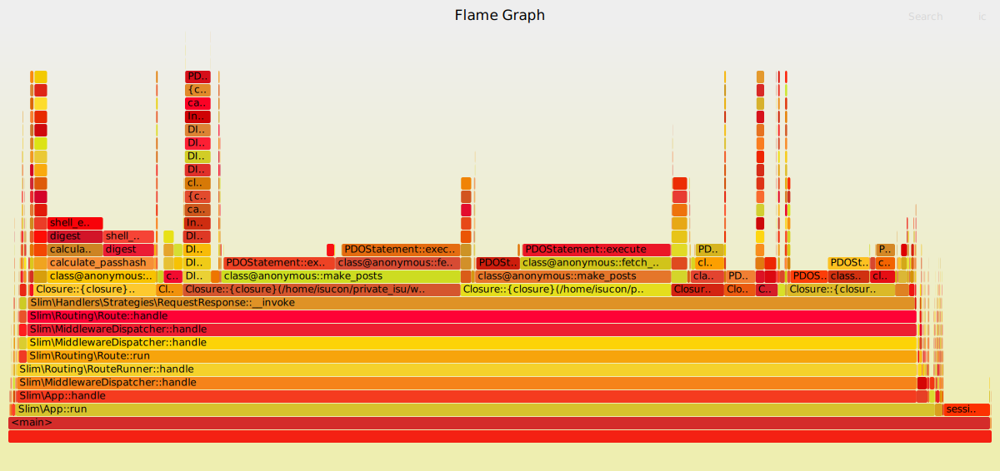

# 点数ログ

ここでは private-isu を解くにあたっての点数のログを一覧します。

## 初回ベンチマーク (Ruby実装): 1026点

```sh
{"pass":true,"score":1026,"success":889,"fail":0,"messages":[]}
```

## PHP実装に切り替え: 3288点

```sh
{"pass":true,"score":3288,"success":3085,"fail":0,"messages":[]}
```

## 各種計測ログや計測を仕込んだ後: 2802点

```sh
{"pass":true,"score":2802,"success":2627,"fail":0,"messages":[]}
```

| COUNT | 1XX | 2XX  | 3XX | 4XX | 5XX | METHOD |        URI         |  MIN  |  MAX  |   SUM   |  AVG  |  P90  |  P95  |  P99  | STDDEV | MIN(BODY) |  MAX(BODY)  |   SUM(BODY)   | AVG(BODY)  |
|-------|-----|------|-----|-----|-----|--------|--------------------|-------|-------|---------|-------|-------|-------|-------|--------|-----------|-------------|---------------|------------|
| 103   | 0   | 103  | 0   | 0   | 0   | GET    | /                  | 0.875 | 5.175 | 275.395 | 2.674 | 3.712 | 4.270 | 5.005 | 0.823  | 4409.000  | 5886.000    | 537822.000    | 5221.573   |
| 1517  | 0   | 1517 | 0   | 0   | 0   | GET    | ^/image/.+$        | 0.001 | 2.456 | 268.300 | 0.177 | 0.520 | 0.838 | 1.912 | 0.331  | 34439.000 | 1057898.000 | 295909057.000 | 195062.002 |
| 131   | 0   | 131  | 0   | 0   | 0   | GET    | ^/posts/\d+$       | 0.042 | 2.060 | 48.283  | 0.369 | 0.883 | 1.324 | 1.657 | 0.379  | 750.000   | 1836.000    | 167699.000    | 1280.145   |

```sql
# Rank Query ID                            Response time  Calls R/Call V/M
# ==== =================================== ============== ===== ====== ===
#    1 0x624863D30DAC59FA16849282195BE09F  208.9196 67.8%  2801 0.0746  0.00 SELECT comments
#    2 0x422390B42D4DD86C7539A5F45EB76A80   79.6292 25.8%  2932 0.0272  0.00 SELECT comments
#    3 0x100EC8B5C400F34381F9D7F7FA80A53D   10.8826  3.5%   131 0.0831  0.00 SELECT comments
...
SELECT * FROM `comments` WHERE `post_id` = '10000' ORDER BY `created_at` DESC LIMIT 3\G
SELECT COUNT(*) AS `count` FROM `comments` WHERE `post_id` = '6777'\G
SELECT * FROM `comments` WHERE `post_id` = '6121' ORDER BY `created_at` DESC\G
```


## commentsテーブルへindex追加: 27353点

以下のクエリを実行。

```sql
ALTER TABLE comments ADD INDEX post_id_created_at_idx (post_id, created_at DESC);
```

```sh
{"pass":true,"score":27353,"success":25016,"fail":0,"messages":[]}
```

| COUNT | 1XX |  2XX  | 3XX | 4XX | 5XX | METHOD |          URI          |  MIN  |  MAX  |   SUM   |  AVG  |  P90  |  P95  |  P99  | STDDEV | MIN(BODY) |  MAX(BODY)  |   SUM(BODY)    | AVG(BODY)  |
|-------|-----|-------|-----|-----|-----|--------|-----------------------|-------|-------|---------|-------|-------|-------|-------|--------|-----------|-------------|----------------|------------|
| 13143 | 0   | 13143 | 0   | 0   | 0   | GET    | ^/image/.+            | 0.001 | 0.109 | 347.973 | 0.026 | 0.039 | 0.045 | 0.062 | 0.011  | 36601.000 | 1156481.000 | 4207002421.000 | 320094.531 |
| 1205  | 0   | 1205  | 0   | 0   | 0   | GET    | /                     | 0.024 | 0.160 | 115.632 | 0.096 | 0.115 | 0.122 | 0.138 | 0.016  | 2478.000  | 5871.000    | 3517612.000    | 2919.180   |
| 1522  | 0   | 1522  | 0   | 0   | 0   | GET    | ^/posts/\d+           | 0.002 | 0.110 | 47.371  | 0.031 | 0.043 | 0.049 | 0.063 | 0.010  | 708.000   | 1885.000    | 1939409.000    | 1274.250   |

```sql
# Rank Query ID                            Response time Calls R/Call V/M 
# ==== =================================== ============= ===== ====== ====
#    1 0x4858CF4D8CAA743E839C127C71B69E75  43.3642 39.2%  1205 0.0360  0.00 SELECT posts
#    2 0x19759A5557089FD5B718D440CBBB5C55  14.7213 13.3% 14665 0.0010  0.00 SELECT posts
#    3 0x396201721CD58410E070DA9421CA8C8D  11.6983 10.6% 75608 0.0002  0.00 SELECT users
...
SELECT `id`, `user_id`, `body`, `mime`, `created_at` FROM `posts` ORDER BY `created_at` DESC\G
SELECT * FROM `posts` WHERE `id` = '9951'\G
SELECT * FROM `users` WHERE `id` = '521'\G
```



## ユーザの画像をnginxから配信: 57835点

実施したこと: [c38c147](https://github.com/stefafafan/private-isu-php/commit/c38c147e83ba5a3e4a9ad90fbf757eab5049e9b4), [c150c89](https://github.com/stefafafan/private-isu-php/commit/c150c898422cd8133d5e822ad6f225f46dc2925d)

```sh
{"pass":true,"score":57835,"success":55844,"fail":0,"messages":[]}
```

| COUNT | 1XX | 2XX  |  3XX  | 4XX | 5XX | METHOD |        URI         |  MIN  |  MAX  |   SUM   |  AVG  |  P90  |  P95  |  P99  | STDDEV | MIN(BODY) |  MAX(BODY)  |   SUM(BODY)   | AVG(BODY) |
|-------|-----|------|-------|-----|-----|--------|--------------------|-------|-------|---------|-------|-------|-------|-------|--------|-----------|-------------|---------------|-----------|
| 1919  | 0   | 1919 | 0     | 0   | 0   | GET    | /                  | 0.024 | 0.196 | 242.230 | 0.126 | 0.155 | 0.161 | 0.174 | 0.021  | 2568.000  | 5868.000    | 5735867.000   | 2988.987  |
| 600   | 0   | 600  | 0     | 0   | 0   | GET    | /posts             | 0.025 | 0.226 | 92.714  | 0.155 | 0.186 | 0.193 | 0.208 | 0.027  | 5148.000  | 5964.000    | 3315298.000   | 5525.497  |
| 40647 | 0   | 2482 | 38165 | 0   | 0   | GET    | ^/image/.+         | 0.000 | 0.151 | 74.092  | 0.002 | 0.000 | 0.000 | 0.066 | 0.011  | 0.000     | 1156467.000 | 402646247.000 | 9905.928  |


```sql
# Rank Query ID                            Response time Calls  R/Call V/M
# ==== =================================== ============= ====== ====== ===
#    1 0x4858CF4D8CAA743E839C127C71B69E75  78.3924 47.9%   1919 0.0409  0.00 SELECT posts
#    2 0x7A12D0C8F433684C3027353C36CAB572  30.0311 18.3%    600 0.0501  0.00 SELECT posts
#    3 0x396201721CD58410E070DA9421CA8C8D  19.5462 11.9% 122443 0.0002  0.00 SELECT users
...
SELECT `id`, `user_id`, `body`, `mime`, `created_at` FROM `posts` ORDER BY `created_at` DESC\G
SELECT `id`, `user_id`, `body`, `mime`, `created_at` FROM `posts` WHERE `created_at` <= '2016-01-02T11:44:45+09:00' ORDER BY `created_at` DESC\G
SELECT * FROM `users` WHERE `id` = '862'\G
```


## トップページから呼んでいるクエリの全件取得をやめる + ORDER BY狙いINDEX追加: 93054点

実施したことは [188217a](https://github.com/stefafafan/private-isu-php/commit/188217a69723de5d2e09ad4578b1ff7f5aae74ef) と、以下のINDEX追加:

```sql
ALTER TABLE posts ADD INDEX created_at_idx (created_at DESC);
```

```sh
{"pass":true,"score":93054,"success":90016,"fail":0,"messages":[]}
```

| COUNT | 1XX | 2XX  |  3XX  | 4XX | 5XX | METHOD |        URI         |  MIN  |  MAX  |   SUM   |  AVG  |  P90  |  P95  |  P99  | STDDEV | MIN(BODY) |  MAX(BODY)  |   SUM(BODY)   | AVG(BODY) |
|-------|-----|------|-------|-----|-----|--------|--------------------|-------|-------|---------|-------|-------|-------|-------|--------|-----------|-------------|---------------|-----------|
| 3268  | 0   | 3268 | 0     | 0   | 0   | GET    | /                  | 0.008 | 0.181 | 198.681 | 0.061 | 0.077 | 0.083 | 0.102 | 0.014  | 2408.000  | 5867.000    | 9364326.000   | 2865.461  |
| 770   | 0   | 770  | 0     | 0   | 0   | GET    | /posts             | 0.026 | 0.214 | 109.569 | 0.142 | 0.169 | 0.174 | 0.189 | 0.024  | 5123.000  | 5959.000    | 4257236.000   | 5528.878  |
| 1552  | 0   | 0    | 1552  | 0   | 0   | POST   | /login             | 0.001 | 0.104 | 80.263  | 0.052 | 0.070 | 0.074 | 0.085 | 0.014  | 5.000     | 5.000       | 7760.000      | 5.000     |

```sql
# Rank Query ID                            Response time Calls  R/Call V/M
# ==== =================================== ============= ====== ====== ===
#    1 0x7A12D0C8F433684C3027353C36CAB572  41.5155 33.3%    770 0.0539  0.00 SELECT posts
#    2 0x396201721CD58410E070DA9421CA8C8D  26.7731 21.5% 174747 0.0002  0.00 SELECT users
#    3 0x624863D30DAC59FA16849282195BE09F  15.7744 12.6%  84487 0.0002  0.00 SELECT comments
...
SELECT `id`, `user_id`, `body`, `mime`, `created_at` FROM `posts` WHERE `created_at` <= '2016-01-02T11:46:24+09:00' ORDER BY `created_at` DESC\G
SELECT * FROM `users` WHERE `id` = '58'\G
SELECT * FROM `comments` WHERE `post_id` = '9812' ORDER BY `created_at` DESC LIMIT 3\G
```


## 他のmake_posts周辺クエリも同様に改善する: 112481点
実施したこと: [4ba3089](https://github.com/stefafafan/private-isu-php/commit/4ba3089cb1814b26bd8eade2a8232800b995cd39), [5022739](https://github.com/stefafafan/private-isu-php/commit/5022739217588edc05e5e1dd9fc996851b1eca3b)

```sh
{"pass":true,"score":112481,"success":109220,"fail":0,"messages":[]}
```

| COUNT | 1XX | 2XX  |  3XX  | 4XX | 5XX | METHOD |        URI         |  MIN  |  MAX  |   SUM   |  AVG  |  P90  |  P95  |  P99  | STDDEV | MIN(BODY) |  MAX(BODY)  |   SUM(BODY)   | AVG(BODY) |
|-------|-----|------|-------|-----|-----|--------|--------------------|-------|-------|---------|-------|-------|-------|-------|--------|-----------|-------------|---------------|-----------|
| 3530  | 0   | 3530 | 0     | 0   | 0   | GET    | /                  | 0.007 | 0.145 | 200.530 | 0.057 | 0.072 | 0.078 | 0.095 | 0.013  | 2538.000  | 22238.000   | 10171918.000  | 2881.563  |
| 1320  | 0   | 1320 | 0     | 0   | 0   | GET    | /posts             | 0.010 | 0.163 | 100.339 | 0.076 | 0.092 | 0.096 | 0.111 | 0.014  | 5153.000  | 5991.000    | 7320225.000   | 5545.625  |
| 1674  | 0   | 0    | 1674  | 0   | 0   | POST   | /login             | 0.002 | 0.089 | 80.399  | 0.048 | 0.064 | 0.068 | 0.078 | 0.013  | 5.000     | 5.000       | 8370.000      | 5.000     |

```sql
# Rank Query ID                            Response time Calls  R/Call V/M
# ==== =================================== ============= ====== ====== ===
#    1 0x396201721CD58410E070DA9421CA8C8D  33.7658 32.1% 227976 0.0001  0.00 SELECT users
#    2 0x624863D30DAC59FA16849282195BE09F  18.6468 17.7% 100698 0.0002  0.00 SELECT comments
#    3 0x422390B42D4DD86C7539A5F45EB76A80  17.8097 16.9% 102654 0.0002  0.00 SELECT comments
...
SELECT * FROM `users` WHERE `id` = '878'\G
SELECT * FROM `comments` WHERE `post_id` = '9916' ORDER BY `created_at` DESC LIMIT 3\G
SELECT COUNT(*) AS `count` FROM `comments` WHERE `post_id` = '936'\G
```


## make_posts内のpostのuserを引いてくるクエリをなくす: 124309点

実施したこと: [3ed1711](https://github.com/stefafafan/private-isu-php/commit/3ed1711b65dd71a3867d94a2d020691cfdf07003)

```sh
{"pass":true,"score":124309,"success":120796,"fail":0,"messages":[]}
```

| COUNT | 1XX | 2XX  |  3XX  | 4XX | 5XX | METHOD |        URI         |  MIN  |  MAX  |   SUM   |  AVG  |  P90  |  P95  |  P99  | STDDEV | MIN(BODY) |  MAX(BODY)  |   SUM(BODY)   | AVG(BODY) |
|-------|-----|------|-------|-----|-----|--------|--------------------|-------|-------|---------|-------|-------|-------|-------|--------|-----------|-------------|---------------|-----------|
| 3913  | 0   | 3913 | 0     | 0   | 0   | GET    | /                  | 0.008 | 0.130 | 189.434 | 0.048 | 0.064 | 0.070 | 0.089 | 0.013  | 2435.000  | 5880.000    | 11391827.000  | 2911.277  |
| 1430  | 0   | 1430 | 0     | 0   | 0   | GET    | /posts             | 0.008 | 0.185 | 99.323  | 0.069 | 0.085 | 0.091 | 0.121 | 0.015  | 5142.000  | 6022.000    | 7913154.000   | 5533.674  |
| 1800  | 0   | 0    | 1800  | 0   | 0   | POST   | /login             | 0.002 | 0.138 | 83.596  | 0.046 | 0.062 | 0.067 | 0.080 | 0.014  | 5.000     | 5.000       | 9000.000      | 5.000     |

```sql
# Rank Query ID                            Response time Calls  R/Call V/M
# ==== =================================== ============= ====== ====== ===
#    1 0x624863D30DAC59FA16849282195BE09F  22.0659 21.7% 110842 0.0002  0.00 SELECT comments
#    2 0x396201721CD58410E070DA9421CA8C8D  21.2831 20.9% 135728 0.0002  0.00 SELECT users
#    3 0x422390B42D4DD86C7539A5F45EB76A80  21.0747 20.7% 113004 0.0002  0.00 SELECT comments
...
SELECT * FROM `comments` WHERE `post_id` = '9879' ORDER BY `created_at` DESC LIMIT 3\G
SELECT * FROM `users` WHERE `id` = '172'\G
SELECT COUNT(*) AS `count` FROM `comments` WHERE `post_id` = '9820'\G
```



## make_posts内のcomment_countのN+1改善: 141431点

実施したこと: [2966fdd](https://github.com/stefafafan/private-isu-php/commit/2966fdd5d8ab97b442e49eece5a6c1a3a8fc9efd)

```sh
{"pass":true,"score":141431,"success":137615,"fail":0,"messages":[]}
```

| COUNT  | 1XX | 2XX  |  3XX  | 4XX | 5XX | METHOD |        URI         |  MIN  |  MAX  |   SUM   |  AVG  |  P90  |  P95  |  P99  | STDDEV | MIN(BODY) |  MAX(BODY)  |   SUM(BODY)   | AVG(BODY) |
|--------|-----|------|-------|-----|-----|--------|--------------------|-------|-------|---------|-------|-------|-------|-------|--------|-----------|-------------|---------------|-----------|
| 4474   | 0   | 4474 | 0     | 0   | 0   | GET    | /                  | 0.004 | 0.095 | 174.277 | 0.039 | 0.052 | 0.057 | 0.069 | 0.010  | 2586.000  | 22488.000   | 12968973.000  | 2898.742  |
| 1620   | 0   | 1620 | 0     | 0   | 0   | GET    | /posts             | 0.006 | 0.132 | 97.146  | 0.060 | 0.076 | 0.082 | 0.094 | 0.013  | 5146.000  | 6065.000    | 8972855.000   | 5538.799  |
| 1971   | 0   | 0    | 1971  | 0   | 0   | POST   | /login             | 0.002 | 0.101 | 87.836  | 0.045 | 0.061 | 0.066 | 0.077 | 0.014  | 5.000     | 5.000       | 9855.000      | 5.000     |

```sql
# Rank Query ID                            Response time Calls  R/Call V/M
# ==== =================================== ============= ====== ====== ===
#    1 0x624863D30DAC59FA16849282195BE09F  25.4541 27.5% 126227 0.0002  0.00 SELECT comments
#    2 0x396201721CD58410E070DA9421CA8C8D  23.1541 25.0% 150099 0.0002  0.00 SELECT users
#    3 0xCDEB1AFF2AE2BE51B2ED5CF03D4E749F  11.7377 12.7%    422 0.0278  0.00 SELECT comments
...
SELECT * FROM `comments` WHERE `post_id` = '9795' ORDER BY `created_at` DESC LIMIT 3\G
SELECT * FROM `users` WHERE `id` = '759'\G
SELECT COUNT(*) AS count FROM `comments` WHERE `user_id` = '908'\G
```


## MySQLのbinlog無効化: 153314点

実施したこと: [5e370eb](https://github.com/stefafafan/private-isu-php/commit/5e370ebbd633fecc0a1e32c66c63b2653e192095)

```sh
{"pass":true,"score":153314,"success":149158,"fail":0,"messages":[]}
```

| COUNT  | 1XX | 2XX  |  3XX   | 4XX | 5XX | METHOD |        URI         |  MIN  |  MAX  |   SUM   |  AVG  |  P90  |  P95  |  P99  | STDDEV | MIN(BODY) |  MAX(BODY)  |   SUM(BODY)   | AVG(BODY) |
|--------|-----|------|--------|-----|-----|--------|--------------------|-------|-------|---------|-------|-------|-------|-------|--------|-----------|-------------|---------------|-----------|
| 4787   | 0   | 4787 | 0      | 0   | 0   | GET    | /                  | 0.006 | 0.112 | 173.843 | 0.036 | 0.049 | 0.054 | 0.066 | 0.010  | 2422.000  | 5881.000    | 13564959.000  | 2833.708  |
| 1710   | 0   | 1710 | 0      | 0   | 0   | GET    | /posts             | 0.006 | 0.150 | 97.299  | 0.057 | 0.071 | 0.076 | 0.086 | 0.012  | 5153.000  | 6016.000    | 9467970.000   | 5536.825  |
| 2135   | 0   | 0    | 2135   | 0   | 0   | POST   | /login             | 0.001 | 0.127 | 88.153  | 0.041 | 0.055 | 0.060 | 0.070 | 0.012  | 5.000     | 5.000       | 10675.000     | 5.000     |

```sql
# Rank Query ID                            Response time Calls  R/Call V/M
# ==== =================================== ============= ====== ====== ===
#    1 0x624863D30DAC59FA16849282195BE09F  27.0061 28.5% 134845 0.0002  0.00 SELECT comments
#    2 0x396201721CD58410E070DA9421CA8C8D  25.1847 26.6% 162195 0.0002  0.00 SELECT users
#    3 0xCDEB1AFF2AE2BE51B2ED5CF03D4E749F  13.8780 14.7%    495 0.0280  0.00 SELECT comments
...
SELECT * FROM `comments` WHERE `post_id` = '1607' ORDER BY `created_at` DESC LIMIT 3\G
SELECT * FROM `users` WHERE `id` = '554'\G
SELECT COUNT(*) AS count FROM `comments` WHERE `user_id` = '660'\G
```


## make_posts内のcommentsのN+1解消: 188721点

実施したこと: [ccb0f52](https://github.com/stefafafan/private-isu-php/commit/ccb0f52d260ad9a25a4711a1b2bd02ad9c05c84f)

```sh
{"pass":true,"score":188721,"success":183801,"fail":0,"messages":[]}
```

| COUNT  | 1XX | 2XX  |  3XX   | 4XX | 5XX | METHOD |        URI         |  MIN  |  MAX  |   SUM   |  AVG  |  P90  |  P95  |  P99  | STDDEV | MIN(BODY) |  MAX(BODY)  |   SUM(BODY)   | AVG(BODY) |
|--------|-----|------|--------|-----|-----|--------|--------------------|-------|-------|---------|-------|-------|-------|-------|--------|-----------|-------------|---------------|-----------|
| 6050   | 0   | 6050 | 0      | 0   | 0   | GET    | /                  | 0.004 | 0.080 | 148.301 | 0.025 | 0.036 | 0.040 | 0.050 | 0.009  | 2480.000  | 5872.000    | 16882666.000  | 2790.523  |
| 2000   | 0   | 2000 | 0      | 0   | 0   | GET    | /posts             | 0.005 | 0.091 | 94.169  | 0.047 | 0.060 | 0.065 | 0.074 | 0.011  | 5156.000  | 6012.000    | 11093922.000  | 5546.961  |
| 2532   | 0   | 0    | 2532   | 0   | 0   | POST   | /login             | 0.001 | 0.079 | 94.127  | 0.037 | 0.051 | 0.055 | 0.064 | 0.011  | 5.000     | 5.000       | 12660.000     | 5.000     |

```sql
# Rank Query ID                            Response time Calls  R/Call V/M
# ==== =================================== ============= ====== ====== ===
#    1 0x396201721CD58410E070DA9421CA8C8D  27.2668 33.6% 184960 0.0001  0.00 SELECT users
#    2 0xCDEB1AFF2AE2BE51B2ED5CF03D4E749F  16.1095 19.9%    552 0.0292  0.00 SELECT comments
#    3 0xB404C51243E51A86EF50167151FA4238  12.3547 15.2%    552 0.0224  0.00 SELECT posts users
...
SELECT * FROM `users` WHERE `id` = '928'\G
SELECT COUNT(*) AS count FROM `comments` WHERE `user_id` = '920'\G
SELECT `posts`.`id`, `posts`.`user_id`, `posts`.`body`, `posts`.`mime`, `posts`.`created_at`, `users`.`account_name` FROM `posts` JOIN `users` ON `posts`.`user_id` = `users`.`id` WHERE `users`.`del_flg` = 0 AND `posts`.`user_id` = '221' ORDER BY `posts`.`created_at` DESC LIMIT 20\G
```


